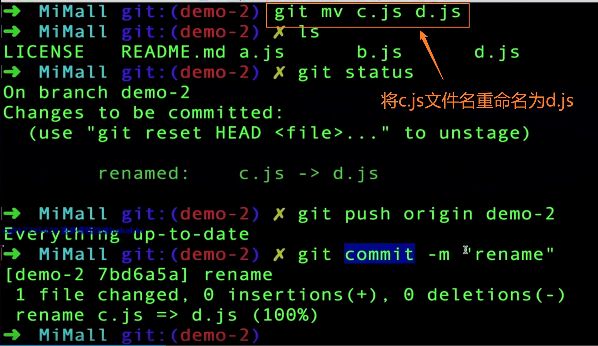
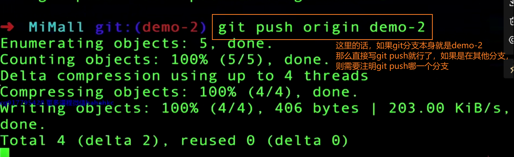
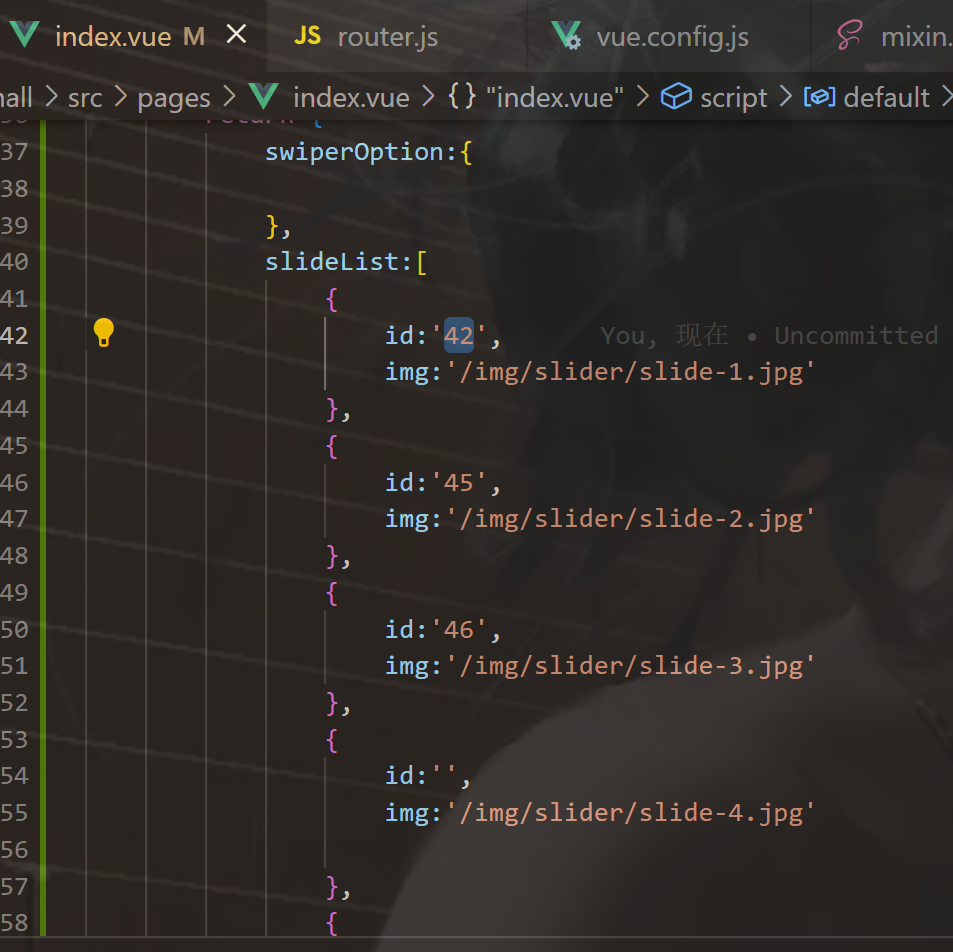
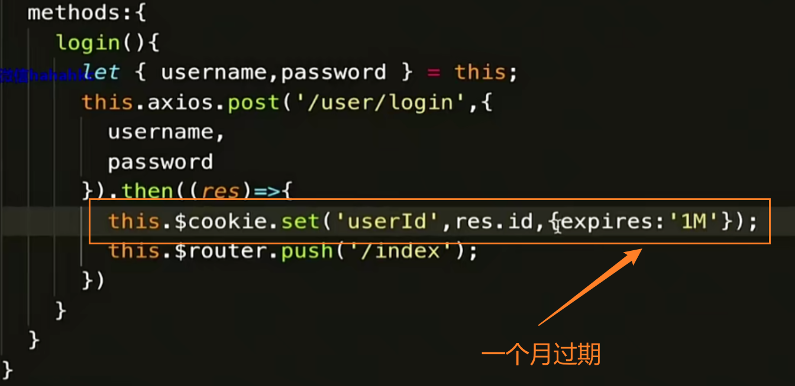

# 第一章 课程简介

## 1-1_课程导学


​	

## 1-2_Node环境的安装

Node是一套用前端语法开发的后端语言，可以把他看成java一样来看待


​	

## 1-3_Node升降级


Mac电脑上允许多个node版本存在，可以根据项目需要进行版本切换

​	

​	

# 第二章 Git安装和配置

## 2-1_Git的安装


​	

## 2-2_Git配置


​	

## 2-3 Git配置SSH公钥


创建线上仓库


​	

添加了公钥私钥，就把记住账号密码给删了，不然git不知道用谁的验证机制，到底谁生效了


但我们会发现 在git push的时候，还是要输账号密码，这是为什么呢？


因为我们用的是HTTPS的url，而不是SSH，所以用不了公钥私钥进行身份验证上传的方式，公钥本身就是用SSH去生成的

用SSH去克隆项目才能确保你的公钥是可用的

私钥是本地服务器 公钥在线上仓库

​	

## 2-4 VSCode操作Git


​	

**vscode里合并分支**


切换到需要合并的分支，ctrl shift P唤出命令行窗口 输入git merge 点击想要进行合并的分支 进行合并 合并完将暂存区的文件提交到远程仓库就OK了

​	

合并冲突在vscode中很友好 已会就不做笔记了

只需选择做咋样的保留再push上去就OK了


​	

## 2-5 Git常用命令




通过git mv命令进行文件改名 是直接在该文件进行改名 而在vscode进行文件改名（例如将 c.js 改为 d.js ）则是删除c.js文件并新增一份d.js文件

​	




​	

git log 查看日志 里面记录着历史操作

​	


为什么是 : 实际上前面是空 是空就把tag给干掉


删除的时候，git push 不写 : 会报错

​	


vi 进入后 wq 是退出

​	


checkout不止是切换分支 同时可以撤销文件操作

git checkout . 撤销所有

​	


所以到这我们知道 git revert 版本号 就是回退到该版本号的上一个版本数据，意思是把这个版本号给回退了 所以就显示该版本号的上一个版本号的数据了

​	


还有git reset命令 除了撤销回退的同时 还能抹去提交的历史记录 别人便无法追踪我们的历史提交记录了


但如果撤销的跨度太大的话 会报error冲突 这时我们可以用 git push origin demo-2 --force 来强制撤销

分支与标签在项目发布的时候用得多

​	

# 第三章 Vue Cli4.0安装和使用

## 3-1 VueCli4.0安装

VueCli 我们可以把他当成是一个插件来看待 但凡是插件 安装方式都简单 可以通过npm/yarn下载安装，但安装软件不一样例如node 而cli是插件包 但凡插件一般都会上传npm去 只要是在npm发布的 我们都可以通过npm下载安装


npm如果太慢的话 可以用cnpm，就可以不用翻墙 用的是国内的源镜像


项目用到的vuecli版本

脚手架能做什么呢？他能做很多东西，他会自动帮我们集成一些webpack的东西，帮我们构建打包编译，包括一些基本的架子包括我们入口的js，帮我们把vue的一些基本的单页面程序给它搭出来，那我们只需要填一些页面，填一些路由只需要一些插件就可以把项目跑起来。那么脚手架就等于是帮我们搭了一个基础的架构，实际上就是项目的非右架构，我们后面会讲解项目的右架构，脚手架就是我们项目的一个最基础的架构


视频中的4.0.8的vuecli版本被弃用了，安装了稍微高点的版本4.5.7

当无法覆盖安装的时候 再去卸载重新安装

​	

## 3-2 VueCli4.0使用


​	

创建项目有两种方式

1. 通过VueCli脚手架工具 使用 `vue create 项目名称(小写)` 命令来进行创建
2. 先不创建项目 而是使用 `vue ui` 命令 启动项目管理器 之后在项目管理器中创建项目 如果我们已创建了项目 就不用创建了 直接导入就行

​	

导入mall文件夹


​	

这些插件是辅助我们项目开发的 最终不会被编译到我们项目中去


​	

[老师请教一下，我这边在VueCli UI系统中输入端口号，无法终止项目-慕课网 (imooc.com)](https://coding.imooc.com/learn/questiondetail/184854.html)


​	

项目要跑起来还需要router、vuex等

一般node_moudules太大 我们都没有给它git push上去 太麻烦 不过要也可以


​	


将node_moudules和dist添加到.gitignore文件中 太大没上传 麻烦且怕远程仓库受不了

​	

## 3-3 Vue-DevTools安装使用

Vue-DevTools是浏览器vue调试的一个插件 安装有两种方式

- 一种是直接从谷歌扩展商店下载
- 一种是从github官方仓库下载后 npm build搭建（具体操作看河畔一角老师的博文）然后会生成一个chrome的文件夹 压缩后打包放到浏览器扩展程序中就可以啦！

​	

​	

# 第四章 项目基础架构

## 4-1 跨域-CORS

在控制台里的XHR请求中查看


前端要调用哪个网站进行访问，后台允许 就能调

​	


easy-mock这个网站gg了 他是允许所有人调用

网站被调用可能会不安全 我们可以设置谁可调用

​	


axios本身是一个promise的结构 所以我们可以通过.then的方式去做链式调用

​	


​	

## 4-2 跨域-JSONP

不在控制台XHR请求中，而是相当于调用一个接口 在JS

比较流行的一种方式（跨域）


前端需要安装JSONP插件


​	

jsonp不是请求 只是一段js脚本 所以访问慕课网成功 axios访问失败


​	

代理proxy还要修改服务器配置 用cors后端又不想改，所以jsonp在之前成为了最流行的一种跨域方式

jsonp请求不是一个真正的请求

```vue
<script>
// import HelloWorld from './components/HelloWorld.vue'
// import axios from 'axios'
import jsonp from 'jsonp'

export default {
  name: 'app',
  components: {

  },
  data(){
    return{
      
    }
  },
  mounted(){
    let url = '/api/activity/servicetime'
    // axios本身是一个promise的结构 所以我们可以通过.then的方式去做链式调用
    // axios.get(url).then(()=>{
      
    // })
    jsonp(url,(err, res)=>{
      let result = res;
      this.data = result;
    })

  }
}
</script>
```

​	

## 4-3 跨域-接口代理


jsonp内部封装了一个callback参数（回调函数）

vue.config.js是webpack的配置表 很重要！

devServer（配置表）

vue.config.js遵循node.js 用module.exports的方式

有空可以看看node.js的API怎么配置的

通过vue.config.js可以修改项目启动的端口

changeOrigin是否将主机口的原点更改为目标url地址

​	

什么是代理？讲一个简单例子：当你转发/A接口的时候，实际上转发的是/B接口，这就是代理

​	

vue.config.js 名字不能改

修改了配置文件信息 要重启服务器生效

​	

## 4-4 接口梳理


status不返回非0是不正常的

​	

设计稿方便我们了解设计页面有哪些，以及前端项目要怎么搭比较合理，跟后端同学对接接口结构 状态码status等等


​	

## 4-5 目录结构设置

```api
这里建议把大图片放在public里面 把小图片放在assets里面

api接口文件夹 index.js 放我们整个项目的api请求 地址统一管理

util index.js 格式化 文字/数字转换 把公共方法放util里面去

storage 是我们前端用的比较频繁的 他是我们数据存储的对象 index.js 怎么去存值取值删除值

因为我们项目会用到vuex 所以我们建一个store文件夹 vuex后面会详细讲解 这里到时候会分几层级结构

路由看情况 文件多就建个router文件夹 文件只有一个就直接建router.js

建一个pages index.vue是我们的首页
```

---

大概项目雏形就如上所述 其实还有环境变量的设置 等讲到环境变量的时候再进行讲解设置

任何项目结构都不是一成不变 根据业务情况（增加/减少）进行微调，现在是根据设计稿和以往经验搭一个雏形

​	

## 4-6 基本插件介绍


​	

```html
6.失败的一天 一天没学习 出现是scss错误知道是在哪里了，在App.vue中的style样式 scope引入scss 但并没有先npm install 导致 found not module
7.安装插件小合集：
npm install vue-lazyload@1.3.3 --save-dev
npm install element-ui@2.13.0 --save-dev
8.四、没有清理缓存
每次装包失败报错后记得都要 npm uninstall xxx 清除装包错误留下的缓存。
比如 npm i -D node-sass 报错了，就要执行一遍 npm uninstall node-sass，然后再重新安装。
9.sudo是mac下输入密码验证身份的命令，因此windows用户应该是以管理员身份运行命令行工具，然后删除sudo即可。
举个例子：删除版本mac下是sudo n rm 版本号，windows下应该是n rm 版本号。
10.npm install node-sass@4.13.0 --save-dev
11.今日mvp！！！！！！！！！！！
【npm install node-sass死活安装不上，最后终于搞定】
https://blog.csdn.net/wk964269669/article/details/72845651?spm=1001.2101.3001.6650.1&utm_medium=distribute.pc_relevant.none-task-blog-2%7Edefault%7ECTRLIST%7ERate-1-72845651-blog-125441010.pc_relevant_multi_platform_whitelistv6&depth_1-utm_source=distribute.pc_relevant.none-task-blog-2%7Edefault%7ECTRLIST%7ERate-1-72845651-blog-125441010.pc_relevant_multi_platform_whitelistv6&utm_relevant_index=2
```

​	

https://tdesign.tencent.com/starter/vue/#/dashboard/base


​	

起飞！如何用nvm控制版本nodejs 下方两篇文章教学

[将nodejs的高版本降级为低版本（切换node版本）](https://juejin.cn/post/7094576504243224612)

[nvm安装，nvm use 一直报错exit status 1 或 exit status 145 问题？](https://wuhou.fun/390.html)

​	

今日mvp！！

[npm install node-sass死活安装不上，最后终于搞定](https://blog.csdn.net/wk964269669/article/details/72845651?spm=1001.2101.3001.6650.1&utm_medium=distribute.pc_relevant.none-task-blog-2%7Edefault%7ECTRLIST%7ERate-1-72845651-blog-125441010.pc_relevant_multi_platform_whitelistv6&depth_1-utm_source=distribute.pc_relevant.none-task-blog-2%7Edefault%7ECTRLIST%7ERate-1-72845651-blog-125441010.pc_relevant_multi_platform_whitelistv6&utm_relevant_index=2)

​	


​	

​	

## 4-7 路由封装

主要是对router.js与组件的编辑配置

routes 配置子路由/路由列表

​	

## 4-8 Storage封装


现在后端的些报文会放到前端存储 导致cookie可能有点不够用了 cookie设置了它的域名、规定时间、路径，然后把cookie值存进去，然后cookie会发送到服务器端

所以cookie针对大段报文来说 用storage比较好

cookie有规定时间 例如有效期7天/30天过期等等，过期之后要重新登录而   localStorage不会，localStorage在浏览器端存储（存本地unit存储里了） ，sessionStorage是绘画技术，sessionStorage是在浏览器里面存的，浏览器关闭就没了

​	

例如这里就是前端发送给服务器的，这就是前端发送给服务器的cookie技术，而这个发送不是我们手动去发送的，而是服务器自动去浏览器端的cookie，自动发送给服务端


sessionStorage也是存储内存中的

cookie有路径限制 例如写在./A下面 ./B下就看不到这个cookie了

而Storage是没有这种限制的，例如写在https://www.csdn.net/这个根路径（域名）中，不管在哪里子路径都可以看到这个Storage

cookie的API稍微模糊一些，通过document.cookie去设置它的域名他的规定时间它有点路径等等，不像Storage 我们可以写个值 例如setItem keyvalue一个非常清晰的keyvalue去帮助我们存储它的值

以上便是cookie和Storage的关系与区别

而localStorage和sessionStorage也讲了区别，localStorage是本地unit存储 而sessionStorage是内存存储 sessionStorage会随着浏览器关闭而关闭，而localStorage不会 这是他们一些区别和联系


注意规范的使用 给webpack用的是config的规范例如vue.config.js 给代码项目用的是es6的规范


操作key一个就够了 别写一堆

​	

## 4-9 接口错误拦截


**统一报错**

错误 是底层（给开发者看）传递给业务层（给客户看），业务层报错信息由前端负责展示

**未登录统一拦截**

权限问题 例如未登录账号要查看订单 这肯定是不允许的

**请求值、返回值统一处理**

例如将时间的规范改为以时间戳的形式返回

​	

- axios.get()传参用params

- axios.post()传参就直接是写参数 不用params

* 也有复合的写法

​	

同时发多个请求用axios.all，因为一个网页一次可能有几个请求，一次请求一个loading 开关开关效果体验很差 所以用axios.all来一次性接收多个请求


请求接口地址和域名不是同一个地址就需要配置baseURL 如果不配置他的话 需要在每一个接口写一个完整的接口地址

timeout是操作时间 一般是设置5-8秒

headers可传可不传

import包养成一个习惯 把插件放上面 把组件放下面

axios我们在每个页面都要写这个名字 还要导入他 很麻烦

vue-axios是把他这个作用域对象挂载到vue实例上面去 方便我们用js去调用


interceptors 拦截器 用来拦截信息

​	


response是axios插件封装给我们的，它并不代表接口返回给我们的值，response.data才是取到我们接口的值，而这个data（人家里面的值就叫data）是axios内部做一层封装，这些都是有规范的

response.data.data才是我们接口返回的值

路由像这种有#的 /#/ 就是哈希路由

接口域名和前端域名一样称为接口代理 一样的话baseURL不用写完整 直接写/api

后端接口都没加/api，可能觉得稍微有点麻烦，但没关系我们前端的话可以处理，我们在转发的时候可以把api干掉

​	


​	

## 4-10 接口环境设置

代理方式是最简单最安全的方式


跨域方式不同 配置不同，baseURL的书写也不一样 出了问题难当责任，所以我们这节课把环境封装成一个模块 统一进行管理

多了解一下webpack的基本配置信息 打包


​	

switch (process.env.NODE_ENV) { // process.env.NODE_ENV可以获取--mode（package.json）传递过来的参数（环境变量） 可以去node.js官方文档查阅相关知识点，而为什么我们可以取到nodejs的环境变量呢？因为我们项目本身就是在node的服务器运行起来的

接口代理的配置信息可以在vue.config.js中修改

本节重点讲环境变量怎么去配置


有两点需要大家注意 我们--mode的参数不能随便写，开发环境只能叫development、生产环境只能叫production 要自定义也可以 待会讲


正确写法如下图 不然报 找不到依赖错误


​	


更换测试环境（环境设置）

如果我们在建的时候 test不生效，可以建一个 .env.test 将环境变量注入进去 （因为有时一些配置信息不生效）


然后这样的话他就可以加载成功了


prev 是预发布版本

​	

## 4-11 Mock设置（1) (2）

Mock就是模拟数据

前端开发的工作有两步

1. 做网页开发
2. 做数据交互

跟前后端对接联调就是交互，我们发起一个请求，能把数据拿回来

将静态的做成动态的


交互在后期需要和后端同学进行交互，包括接口联调，提示、上预发布等等，在开发阶段 后端同学也在开发阶段，同时处于开发阶段 Mock就起到作用了 因为我们只有接口文档 还没有开发完成 所以此时Mock就起到一个非常重要的作用了 它可以提前帮助我们接口给搭建好 就好比接口人员已经把接口搭建好了

将Mock独立出来 可以灵活插拔 数据可删可减

​	


easy-mock的话是开源项目 极力推荐的方式是从github clone源码下来 自己在公司内部搭建一套easy-mock平台 不然线上的因为免费 人一多带宽就不够 容易垮掉

集成Mock API 等于是把这个mock的server放到我们前端的项目里面去 变相的去作为中间层的代理和拦截 然后把返回值返回给我们


因为public是根目录所以直接写mock就好了，因为我们访问的是一个json静态文件 所以用axios获取 发送给浏览器 浏览器接收后便可以显示给我们看 像这样我们访问项目的其他静态文件 也是可以访问到的

```html
二、导致304状态码的原因如下：

(1)页面长时间不更新：

如果页面内容长时间不更新，如静态页面，基本上直接返回304个状态码，即使动态页面内容不变，也会出现这个问题。

(2)CDN缓存

当你打开cdn加速时，即使你的内容页面发生了变化，但是cdn的缓存没有更新，也可能导致这个问题。面对这个问题，你可能需要设置cdn定期更新时间，但这与百度快照不更新不同。
```


开启就好了 停用缓存 每次重新加载文件 返回的状态码就是200 而不是304

​	


可以使用mockjs生成模拟数据（多条），不用我们自己手写，所以可以花时间学习一下mockjs的语法

https://www.npmjs.com/

http://mockjs.com/

https://github.com/nuysoft/Mock/wiki/Getting-Started

比较推荐上面方法学mockjs 

easy-mock学习成本比mockjs大

​	

import和require的区别


import是预编译加载，意思是你编译的时候 import的这个文件就会被加载进来，就会被写入内存当中，但是require不会，require是你在从上到下执行的时候，才去加载的 如果你mock是false的话 它是不会被加载进来的


我们如果是import mockjs在main.js中的话 mockjs被预编译加载 那么编译的时候就会被加载进来 那么你发请求就会永远被它拦截了 而我们是不希望永远被拦截的 我们希望当你mock开关打开的时候才会被拦截 当你关闭的时候就不会被拦截

这样在后期扩张维护的时候也很轻松，加工加模块也容易

mock.js的数据模拟制造能力一级！后台数据有时故意搞null 不如mock.js


==要设置断点才能查看结果啦~==


​	

在这里学习mock语法


​	


easy-mock 新建项目 写json 生成mock数据 贴回这里


​	

**小结**


```html
本地创建json后期需要改请求的接口地址

easy-mock平台只需要我们自己在上面创建项目，根本就不需要安装插件 那么就可以集成进来了 而且后期没什么污染 我们只需要把代码给它注释掉就好了；唯一的缺点就是容易垮掉容易宕机 毕竟免费

集成Mock API 就是通过import方式 通过npm 安装依赖 最后集成到项目中去，我们相当于是把这个server搬到我们这个项目里面来了

优先推荐easy-mock，但前提是公司自己有搭建easy-mock平台，如果没有的话就集成mock API比较好 最后才是本地json
```

​	

# 第五章 商城首页

## 5-1 Nav-Header组件

### （1）实现顶部导航条功能

第四章主要讲的是架构部分 要二刷到时候 吸收不完全

基本上做网页开发的都要提供一份reset.scss ，reset其实没什么东西 只是针对我们网页的内置的样式把他覆盖掉 像我们的body、div、p、h1标签 他本身浏览器有一些内置样式 这也就是为什么有的时候我们写h1会发现它有边框有边距 那是因为浏览器内置给它一个默认的样式 我们需要把这个默认的样式给它干掉 一般我们会设置margin: 0; padding: 0; outline: none;

响应式的网页 大小随着分辨率的变化而变化大小 成本会提高很多

我们做网站做网页的时候，一定要给我们网页做一个**安全距离** 防止页面挤压变形不好看，还有合理性（屏幕分辨率不同 网页显示也不同） 设置一个最小的宽度，不要超过这个宽度，设置margin：auto居中就好了

网页字体最小像素就是12px

把常规字体大小和颜色提取出来放到congif.scss

scss的好处就是预编译 可以提前定义变量 通过加载变量的方式去动态实现一个样式的这个功能

​	

宽度不需要设置 因为你分辨率不一样 大家一定不要设置宽度 宽度它不管多宽 那只要是我们有安全距离就可以了

基本我们很多东西都是放在我们容器container里面去的

一般我们防止我们页面刷新的话 我们会在 <a href=""></a>的href中写`javascript:;` 这样页面就不会刷新 否则的话我们页面会刷新

一般我们高度和行高都是一样的

scss的好处就是语法可以进行嵌套而不用统计，而我们css是不能进行嵌套的

css是采用缩进的形式来规定样式的父子级 编写样式

​	


左右两边有边距 是浏览器内置的默认样式问题 我们只需要引入前面的scss的rest.scss到App.vue就行了


因为div是块级元素 所以下面的元素会被挤下来

我们一般用no-repeat来控制填充

​	

### （2）实现导航菜单

### （3）实现导航菜单


把通用的样式给它抽离出来 封装在base.scss文件里 当我们用到该class样式时，会默认加载该base.scss文件已定义的样式


- base放的是我们一些公共机制

* config放的是我们一些基本配置信息

* reset是覆盖我们浏览器默认的样式设置

​	


flex布局可以控制图标 不然有时可能不会居中

​	


​	

mixin是完美scss系统非常重要的一部分，它可以把这个变量抽离出来，甚至可以把一些样式定义成方法，把公共部分提取出来


@mixin真的强大 封装成函数 复用性强 ts也是

​	


注意单位也要传


当我们团队达到四五人七八人的时候呢，你会发现这种方式需要一个专人去维护我们的mixin，专门去搞我们的项目架构，搞我们的这个公共机制，那么给各个组员呢，提供这个便利

​	

> 头部菜单到这里也就基本开发完毕了~

​	

### （4）实现导航栏下拉功能

循环用ul标签最合适，因为li标签刚好是一个对称结构 可以无限循环下去 这里的话 li就是每一个商品

target=“_blank” 打开新窗口

图片的话 宽和高只能设置一边 这样才会等比例缩放 如果宽高都定死了话 图片会被压缩

a标签是行内元素，a没给display:inline-block 撑不开

font-weight:bold 是加粗 但也可以不给bold给具体数值(100-800)

大家可以习惯性的 比如说有些样式你在前期不确定的话呢 你可以直接再浏览器上面右键审核元素这边去调 调好之后呢 你把它拷过去也可以删它 这样你可以发现文字和图片都同时居中了


​	

定义伪类没生效的原因：没content占位！

子元素加了绝对定位 父元素可能需要加相对定位 位置才是正确的

​	

### （5）动态的交互|过滤器|用户登录判断

mounted-我们需要初始化调用我们的一个方法

methods-第一个就是获取我们的手机列表、商品列表

axios用get()方法传参的话 用params传参，post请求的话就直接写

要懂得怎么调试，network是看我们报文的，xhr看我们请求

开发阶段用mock 联调的时候就不能用mock啦，要真实的接口地址


如果状态码是404 可能是我们改了配置信息 例如vue.config.js 修改了接口地址但没有重启服务

然后我们会发现请求网址多了个/api 但实际上我们接口是没有/api的，这个/api是我们前端自己加上去的，我们希望所有接口都是/api开头，这样的话方便我们自己管理，因为我们希望做一些拦截等等


然后congif里会将path的/api置为空，把它覆盖掉

​	

数据请求了之后就是数据的渲染了

建议大家v-for 加个:key key渲染速度更快，而且后期的话复用力更高些，你在重复二次渲染的话呢它会自动缓存，就不用再重复渲染了，直接去取，当然了数据量大的时候才体现得出来 数据量小的话完全没感觉 你加跟不加没什么区别

vue1.0 filters是内置的，2.0及以后就要手写了，没内置

像金额/日期格式化 都会用到我们的过滤器

​	

vue3.x中过滤器已弃用

在 3.x 中，过滤器已删除，不再支持。相反地，我们建议用方法调用或计算属性替换它们。

[[vue/no-deprecated-filter] Filters are deprecated.](https://blog.csdn.net/HGGshiwo/article/details/119753259)


同样可以实现

​	

> 小结一下：本节课学习了下拉元素加上动画过渡以及我们动态的交互，包括一些过滤器功能和用户是否登录判断


​	

## 5-6 Navfooter开发

a的优先级是大于你父级的优先级的，所以颜色设置不生效，所以我们需要再给a定义一个值

​	

## 5-7  Service-Bar组件

服务条组件

scoped代表的是局部的意思，只有当前组件才会被渲染，可能样式是全局的样式，有可能会对其样式产生影响

​	

## 5-8 首页轮播功能实现

> import 'swiper/dist/css/swiper.css'

我们通过npm去安装依赖插件的时候，这个插件和样式都是一块放的，插件一般的话会有一个地址，每个插件npm包确实内部也会通过这个run build去打包，打包完之后的源代码呢，都是放在dist里面去的，所以说我们直接通过swiper/dist 去引用它。而且我们可以发现当前路径下没有这个东西，那么它会自动的去我们这个node model的模块里面去查找



有一些数据为空是为了全方位测试我们的功能

一层一层往下定样式是防止串用，影响其他样式

默认值为true的话，可加可不加

<!-- 因为slot在vue3.x中被弃用了，新增v-slot(可简写为#) v-slot插槽只能在template中使用且不能被div包裹-->

```html
9月28日 【Ben】

遇到的问题
【问题】
1.github里SPA是什么意思？
2.API是什么？

【解决】
1.SPA: 单页应用
2.就是很多关于我们这个插件里面的具体的配置参数都在里面，教程是什么？就是别人有写好的demo来告诉我们怎么去用，大家可以参考demo，别人demo怎么去写的，一般我们是先看教程，先看demo别人怎么去开发怎么去使用，然后当你做的时候，你的功能比别人的功能更复杂，那么这个时候可能它的demo太过于简单，那么这个时候你就需要参考API文档了，因为API文档写的更加详细，毕竟教程里面的demo都是只用到了几个API，你的功能更复杂，那么你就需要花更多的时间去参考里面更多的这种API文档，别人的demo不可能把所有的参数都列出来，这也不太现实。如果你的功能足够复杂，你就一定要花时间去看里面的API的每一个参数干什么用的

今日小结
1.【小米商城】学习了xxx
2.【小米商城】5-7看到了第xx集
3.大家一定要学会看文档 知道怎么去集成我们里面这个插件的一些选项和语法
```


​	

## 5-9 首页轮播菜单实现（1）

height没有生效，可以通过改变我们的核模型来解决，核模型分w3c和IE 核模型

标准核模型的高度是不包括我们的padding值的，而当你把核模型指定为border-box的时候。它的高度是包括padding值的，也就不会超出设置的height了


> 伪类符号是&: 不是$:

我们单纯想要让背景变透明，背景上的文字是不想变透明的，那么我们便不能使用opacity了，不然文字也会一起变透明 opacity会把里面的所有的元素都加一个透明度 甚至连字和图标全部都有透明度

### （2）左侧菜单展开

 为什么二次菜单加transition: all .5s;没有效果反映呢？

> 9.29: 因为hover的是从display:none变为block，要用opacity从0-1才有动画效果（我觉得是错的）

​	

## 5-11 首页广告位实现

:href需要通过字符串来拼接路由

懒加载 减轻我们前端服务器的带宽压力

​	

## 5-12  手机商品实现(1)

flex弹性布局，弹性布局基本上可以解决很多问题，可以避免一些浏览器插件问题引起的麻烦，而且是可以自动排列

描述信息我们一般会用p标签来描述


加 vertical-align:middle; 可以让图片和文字都居中

cursor是鼠标光标的意思

#### (2)

span是行内元素 加不上背景颜色，大小是被字给撑开的，需要设置成inline-block

​	

## 5-14 Model组件实现 (1)

通用性的组件样式建在scss目录里，只有只适用当前页面才建在本vue文件下

modal.scss需要全局引用 我们在App.vue进行引用

​	

## 5-15 (2)

positions:fixed是固定定位

如果让弹框水平居中同时垂直居中呢？可以用位移的方式，定义top和left值（这是一道经典面试题）

而一般我们弹框不会真的让它中规中矩，完全居中，而是会往上偏一点儿，稍微好看一点


​	

## 5-16 Modal动画实现

一般我们定义事件是用v-on:来绑定事件 但我们子组件向父组件传递时，父组件是主键 它不是一个标签，我们这里就不能用click 我们要用传递过来的名称进行定义 叫submit

modal动画实现的几个注意点

1. &.slide-enter 需要放在 &.slide-enter-active 的后面 先进入后激活这个样式
2. modal组件的事件 icon上面需要绑定这个关闭事件 每个按钮上面都要绑定事件
3. 父子传递用$emit 这种事件属于自定义事件 自定义事件需要进行接收 用v-on
4. 登录被拦截到了 以后我们再实现添加购物车的功能

​	

## 5-17 Modal交互补充

写死的 modal 数据用 写好的data变量进行替换

​	

## 5-18 图片懒加载实现

图片懒加载实现属于前端的性能优化的范畴，目的是提高首屏的加载速度，提升用户体验 减少带宽 当我们滚动的时候，图片实际上才会相应的进行加载 

在本地上不消耗带宽 我们可以禁用缓存进行测试


当你部署在服务器上后呢 它就非常的耗带宽了（特别是没有懒加载 一次加载全部素材）

图片有固定的分辨率 超过这个分辨率后就会失真 svg是矢量图 矢量图的话不管把屏幕图片放多大还是缩多小 图片都不会失真 这就是svg 但制作成本比图片高很多

​	

```vue
            <!-- 广告位的缩写 -->
            <div class="ads-box1">
                <a v-bind:href="'/#/product'+item.id" v-for="(item,index) in adsList" v-bind:key="index">
                    <!-- 用v-lazy后 它会自动给我们封装一个src 所以这里不用写 -->
                    
                    <!-- 如果我们没有v-lazy的话 用jquery怎么做呢？加data-img 将data-img值取出来赋值到src 
                        作用原理都差不多 一开始不要给src赋值 把这图片滚出来的时候 我们再把src赋值上去 这个时候图片才会加载
                        这个就是避免了同时并列加载n张图片到首屏 一旦你首屏加载了太多图片资源 就导致你的页面首页是空白的或者白屏
                    -->
                    <!--  -->
                </a>
            </div>


            <div class="banner">
                <a href="'/#/product'30">
                <!-- 注意 凡是指令里面肯定是变量 类型是字符串的话需要用单引号括起来字符串-->
                    
                </a>
            </div>
```


# 第六章  登录页面

## 6-1 登录交互实现

登录是起点 订单是终点

---

login的form表单样式问题


主要是base里面没有做一些控制 给它加一些基础的样式


相对定位是相对于最近的非静态的布局 非静态的定位而来的 不能相对body定位 而要相对container

怎么让它相对container定位呢？使用偏移 position:relative 作为边界


而这里又出现了另一个问题 里面的input框太大超出去了，为什么样式会超宽呢？ 是因为我们这个核模型

分两种 一种是w3c核模型  另一种是IE的核模型 默认是w3c 它的宽度是不包括我们的padding值的


就是这个padding:18 给它撑出去了 这个是我们标准的w3c的核模型 那么我们只需要把它变成一个IE的核模型 这样它的宽度就是固定的 内填充的话是不会记录在宽度内的 这个宽度是包括了它的padding值的

---


​	

登录就包括我们username和password这个账号密码同时呢 给我们返回了一堆信息 一般登录包括我们这个token token作为一个令牌和口令向服务器和用户端 然后我们现在没有token 可能我们就会把ID作为我们一个唯一的标识

vuex单页面数据存储在内存中 但我们页面一刷新 内存中的数据都没了 所以这时候我们需要用户接口把用户信息给拉出来 用v-model实现双向绑定 

大家如果对插件不了解的话 都可以取www.npmjs.com进行学习 例如vue-cookie 学会看懂API 看懂插件

expires 到期；有效期



​	

怎么把用户信息保存起来呢？防止页面刷新数据丢失 

> 用vuex

表单提交首选post

​	

## 6-2 拉取用户信息

登录和购物车本身是在同一个组件内部NavHeader里面的 那我们是不是要把结果放在NavHeader里面呢？不建议用户接口信息放在NavHeader里 为什么呢？ 如果你的页面没有登录 那么我们把这个接口放在这个里面没登陆  其实也没有意义 因为放进来还是一样 username是空 本身你没有登录的话 拉取也是空 最终还是要在登录页面把数据把用户名存入进去 存入到vuex里面去 在这把它拉取出来 那我们这里就建议放在App.vue里面 那我们只需要在这个入口的地方获取一次拉取一次我们的用户信息和购物车商品数量 然后在NavHeader里面 从vuex里面取一次就ok了

 命名是小驼峰命名 拉取数据一般是get  推送数据是post  删除数据可能是post可能是dl/delete都可以

/#/ 这种路由就是哈希路由

JSESSIONID是后端为了识别前端所写的cookie 不是前端的useId useId是前端写的

​	

# 第七章 Vuex集成

## 7-1 初步了解Vuex

vuex是转为vue打造的状态机 帮助我们前端组件之间做数据传输和数据共享 双向绑定只停留在我们的表单层面 只有表单这种视图才是双向绑定 组件之间其实都是单项流通的 两组件之间要共用同一变量或其他数据等就需要用到数据共享技术 cookie/slowly当然也可以实现 但vuex框架最为成熟 达到复用和共享的目的

vuex是MVM框架 模型视图视图模型 现在目前主流的框架都是状态管理框架 vuex便是

像以前都是改变dom 现在是状态的方式通过结合我们的虚拟dom这种方式去实现


vuex只管理这两步


至于变量怎么渲染到视图里面去的 这个还是由我们框架来处理 跟vuex没有关系 vuex只负责数据的传输和共享

用this.$store的方式来获取我们这个vuex的这种状态


mapstate辅助函数 帮助我们简写变量


Getter是对状态业务的处理比如返回一个数组 这个数组里面由脏数据我们不要 可以用Getter进行过滤 但其实你知道的 不用Getter也能进行过滤 我们在渲染的时候也可以把这个数组重新给它处理一遍


actions内置context 也就是上下文对象 通过context去提交我们的commit方法


通过dispatch去派发Action

做到大型、超大型项目后就需要Module进行分模块了


当我们状态改变的以后 它跟组件之间有延迟的时候大家记得用computed这种计算属性，也就是说数据又延迟的时候 你获取这个状态是没有用的 你获取的时候因为页面本身已经渲染完了 你才获取这个状态 它肯定就晚了 那么当你数据有延迟的时候 大家记得用computed计算属性

​	

## 7-2 Vuex框架搭建

组件import的话一定要加./ 不然当作插件去node_module里面去查找

新建store目录 index.js mutations.js action.js 绑定到main.js 


框架搭建完成后 接下来就是实战了 怎么保存变量 怎么读取数据共享

​	

## 7-3 Vuex实战应用

payload：有效载荷

payload data:

> 记载着信息的那部分数据。通常在传输数据时，为了使数据传输更可靠，要把[原始数据](https://baike.baidu.com/item/原始数据?fromModule=lemma_inlink)分批传输，并且在每一批数据的头和尾都加上一定的辅助信息，比如这一批数据量的大小，校验位等，这样就相当于给已经分批原始数据加一些外套，这些外套起到标示作用，使得原始数据不易丢失。一批数据加上它的“外套”，就形成了传输通道中基本的传输单元，叫做[数据帧](https://baike.baidu.com/item/数据帧?fromModule=lemma_inlink)或者数据包（有的地方数据帧和数据包不是同一概念比如[网络传输](https://baike.baidu.com/item/网络传输?fromModule=lemma_inlink)）。这些[数据帧](https://baike.baidu.com/item/数据帧?fromModule=lemma_inlink)中的记录信息的原始数据就是有效载荷数据，即payload data。

​	

login登录后不显示username 存在延迟的情况：

我们组件加载 先加载App.vue 后加载NavHeader 而从NavHeader 中得知 data(){}里的username:this.$store.state.username为纯渲染，没有这个请求时间 而我们App.vue进去后会执行这个接口 很明显我们这个接口的调用是需要花时间的 先读取这个变量的时候会发现是空 当空执行完之后才执行完这个方法 


这个方法回来以后 才把这个里面去存值 所以它中间有一个误差 先取的值后才返回的这个数据 就晚了

那这个问题也好办 我们需要通过这个computed计算属性来解决 当变量读取的时候没有 那么它会重新再计算一次 重新再调用一次这个方法 所以说我们这个需要把username定成一个computed的函数


设置完毕后 我们刷新登录后的网页 username不会消失 虽然会有一闪的时刻没有username 是因为接口调用还没回来 尚且没值 接口回来后就有值了 但如果接口不回来 上面username就会一直没有值


如果我们这里没有用computed计算则可以用mapActions进行简写变量 用map state辅助取做这个渲染

​	

# 第八章 产品站页面

## 8-1 产品站参数组件实现

config.scss可以打印成A4纸放到桌面 也可以做成浏览器插件 当我们写对应数值时 会转换成config.scss里的对应变量 例如#E5E5E5 转换成 $colorF 等等

也可以写成蓝湖插件

​	

## 8-2 组件吸顶实现

现在市面上有很多npm吸顶插件 这节课教原生的吸顶功能实现

一开始没做固定定位样式效果是好的 一旦加上固定定位之后呢 这个样式就跑了 这个依然是我们这个固定定位导致的 因为我们container容器本身的宽度就只有1260安全区域 一旦你在父容器上加一个固定定位之后 父容器的宽度就和你内容区域的宽度一样了 它本身就没有宽了 所以说我们要给nav-bar加一个宽度 width:100%（让内容区域宽度和父容器宽度一样宽） 这样它才能去充满整个浏览器

box-shadow有4个参数值 x轴 y轴 阴影模糊值 阴影颜色

vue里面的吸顶 当我们页面销毁的时候 我们还需要把这个事件给它去掉


否则的话 你在其他页面滚动的时候 这个事件方法也是会一样会加载 那这样的话就浪费资源了 那么这里借用我们这个vue里面生命周期的destoryed()是我们组件销毁的函数 销毁的时候我们同样需要把这个事件给它干掉

实际上addEventListener和removeEventListener都有第三个参数 默认参数值是true 指的是我们这个事件的行为的处理方式 你是用冒泡还是用这个捕获 true是捕获 false是冒泡 那我们需要再通过冒泡的方式把这个事件给它干掉 全部给它干掉 一层层给它干掉

​	

## 8-3 视频模块实现

习惯用overlay来做视频打造制作

controls是我们video视频的控制键 比如说像播放暂停、快进快退等等

上节课有点知识点说不太对 吸顶功能是一定要用固定定位的 不能用绝对定位或相对定位

fixed相对浏览器窗口进行定位

absolute是相对于我们整个HTML文档进行定位

object-fit类似于background-size 可以指定container fear 指定cover cover就等于是把这个视频里面的内容能够覆盖我们整个窗口 container就是让我们这个视频或者图片适配到我们整个窗口

outline是我们这个内置样式 我们可以给它指定文档 防止产生一些干扰

muted是辅助性做静音输出 帮助自动播放

​	

## 8-4 Slide动画实现（1）

本节课讲解两种动画效果 transition和animation 动画效果

1. transition用于单个属性单一的过渡效果

2. animation用于更加复杂的动画效果

为了让大家掌握更多的知识点 这里用animation做slide的slide-down和slide-up的动画效果

​	

## 8-5 (2)

admission是c3的一个属性


我们现在吧这个上节课的代码删掉 transition就不要了

用@keyframes来定义关键动画帧

frame动画一定是成对的

动画代码比transition复杂很多 单一动画用transition更好点

​	

## 8-6 产品站交互实现

前后端的交互

路由跳转是$route router是路由 我们要获取这个路由的跳转方法就用router

axios.get()/post()的`.then(()=>{})` 是链式调用

用router的场景：this.$router.push(`/detail/${id}`);

```vue
视频组件的一个小bug，写完getProductInfo()后审查元素 视频突然出来了 为什么会当我们这个空台拖上去之后呢 你会发现这个视频变大了 因为我们这个拖上去之后 窗口变小了 而我们视频用的是位移的方式 视频位置是在-50%的位置 当你窗口变小了之后 视频就暴露出来了 也就是到了-50%的位置 就看到视频了嘛 所以如果窗口变小了的话 我们需要把video-box给它隐藏掉 

当你窗口变大的时候 实际上是没有问题的 因为它的窗口足够可以承载我，这个视频的宽高；当你窗口变小的时候 窗口已经放不下我们这个视频了 那么问题就暴露出来了 我们视频组件video采用位移的方式 我们需要把video-box给它隐藏掉 
```

​	

# 第九章 商品详情页面

## 9-1 商品详情交互实现

解决float浮动问题

1. 通过div占位
2. 通过伪类 记得content:' ' 占位

route获取路由参数信息

router操作路由

字符串模板 `` 可以直接使用变量 不用去用+加号的方式拼接字符串 方便很多

现在的前端 即使你没有promise 也会想办法把它封装成一个promise

// 加购物车商品成功后 我们要做什么事情？


将商品同步到我们这个购物车信息里面去，右上角的商品数量进行累加

success下代表返回的数据


​	

# 第十章 购物车页面

## 10-1 Order-Header组件

为什么要起order-header 这样去起呢？因为一个页面有一个主的class 这样的话防止我们这个页面之间它的class呢来进行串用

给vue里的style配置scoped是可以的 但它会帮我们生成一堆无用的标签和属性


它来达到你这个页面来复用的话 页面就比较重 就不建议这么去加了 只有在紧急的时刻确实是无法区分的时候 你可以尝试去加一下scoped 但如果你能用这个主class进行区分的话 它就已经是指定作用域了 就不需要你去再加scoped了

【组件复用】 标题都是不一样 需要我们要动态渲染 使用插槽slot的方式来进行复用 在每一个页面进行配置就可以了 我们一定要把这个组件做的灵活

```js
./只是当前目录 不加./也可以检索到路径 不加./没有提示 加了有提示 更方便书写和查找
加./和不加./的区别 一般我们通过js import 导入的时候会把它认为是一个插件（npm里的插件）默认去外面的node modules里面去查找这是不带./的; 如果带了./优先去你当前自己的目录去查找 认为它是外面自己定义的文件
```

font-weight 加粗用的 可以给bold也可以给具体数值

​	

## 10.2 购物车列表渲染

v-lazy是一个指令 只要是指令 这里面的话一定不能够直接写字符串变量

productStock 库存 一共有多少件商品

这个productTotalPrice的话 也是我们后台帮我们计算好了的 也就是说当你这个同样的商品 你添加两件三件 他会计算你这个三件的价格 一共是多少钱 因为这个钱我们一般不放在前端 因为它安全性会比较高 一旦你前端给它篡改了 那就很麻烦了 所以说我们这个商品ID已经是固定的 那么你提交的时候 后台会自动去计算 我们不需要前端把这个价格呢提交给后台 那万一你把它前端这个价格改成零 是不是后台就会按照这个零来进行结算呢 肯定不能是这样的 所以我们只需要对数据价格进行渲染就可以了 不需要进行二次加工

​	


当结构体只有一句话的时候 可以简写（也就是省略大括号）当超过一句话的时候必须加大括号

前端在本地的话 也不需要对价格进行计算 只负责渲染

​	

成功渲染购物车列表


​	

## 10-3 购物车全选和非全选

render 渲染

​	

## 10-4 购物车商品更新和删除

自己写了一个点击删除的弹框确认界面动画

​	

## 10-5 购物车结算

every()练习一下


Element-UI是前端一门非常优秀的UI加上交互的框架

大家要搞清楚CSS框架和JS框架有什么区别 像vue react是我们前端开发的mvc框架 主要是用来去做项目用的 而我们这种呢是UI框架 UI框架不光是静态的 它还包括我们的交互 想过去我们可能就是说把样式绑定到我们的class里面 然后自己要去控制它的v-if/v-show 控制它的显示隐藏 而现在我们只需要用这个插件自动的就可以帮助我们生成这么一个提示信息出来 这就是现在UI框架和过去不同的地方

element-ui还集成到mvc框架中 如element vue、element react、element angular等，也就是说你只要学会了element-ui框架就可以用来开发上面三种mvc框架

element-ui是饿了么的 查一下支付宝的ui框架是什么 都可以学习一下 增加广度

单页面就是我们项目只有一个入口

​	

# 第十一章 ElementUI集成

## 11-1 ElementUI入门梳理

大家记得组件import之后要导入其css样式


但其实不支持这么把整个组件库引入进来 100个只用到4、5个的话 很浪费页面性能 体验感差


按需引入 只把我们需要的组件打包引入 不需要的组件全部过滤在外面

按需引入和按需加载

按需引入 是说外面只把一个框架引入我们想用的这个组件而已 但是打包的时候还是会把整个包打进来

按需加载 只会把它就加载的组件进行打包

ElementUI是UI框架也是交互框架


插件放到vue原型上 便可以在各地引用 使用插件语法便可以激活样式


可以切换英文版本 导入语言包


i18n也是一个优秀的插件


阅读ElementUI官方文档 给它掌握起来！

ElementUI官方文档

- [Vue3 Element UI](https://element-plus.gitee.io/zh-CN/)

- [Vue2 Element UI](https://element.eleme.cn/#/zh-CN)


文件要是藏得太深 可以在外面新建一个文件进行覆盖

element ui只适合做后台管理系统 不适合做外面前端的类似于外面这种门户面向用户面向C的 而商城实际上就是C端的产品 b端是面向自己公司内部用户的 C端面向大众

​	

## 11-2 ElementUI运用

主打方便 实用 界面也不会丑 适合后台管理系统


--save可以保存到项目里面去

-dev可以保存到package.json里面去

代理配置改完之后要重启才能生效

我们要了解哪些东西是会实时编译的？src里的会实时编译 src以外的更改信息要重启服务器进行重新编译的

​	

我们这样就可以保证把对应的组件打包进来


​	

## 11-3 Babel介绍

我们这节课把alert把全部给它替换成我们的这个message

插件我们有两种方式使用

1. 在我们用到的地方去导入它 把这个message给它导入进来
2. 通过prototype把它扩展到我们的vue原型上 再通过this. 的方式去调用 很明显我们通过原型的方式去使用要简单一点
3. 具体使用看main.js、cart.vue、login.vue里面对于elementui的message的插件组件使用示例


  

 .babelrc和babel.config.js一起使用会有点问题 仅使用任一个就不会 所以我们可以通过babel的语法将这两个配置文件合并成为一个

还有第三种配置的方式 就是去package.json里面找到babel的插件信息 指定k值去配置他


在项目部署的章节里我们会讲到前端的性能优化 到时候会使用到babel的一些语法 再给大家简单介绍一下

ES5、ES2015、ES2017、ES2018…..这些语法都各称为是一个插件

为什么叫ES2015呢？因为它是ecma script这个组织下面再2015发布了这么多语法


所以我们称之为es2015 我们现在做的语法（例如箭头函数）每一年都会有一个提案 实际上背后都会有一个插件支持

而preset是ES5、ES2015、ES2017、ES2018…..等插件的总称


我们在上线的时候会把source map给它关闭掉 这个大家不用担心 因为source map本身也会占用我们的一些资源 我们在本地调式的时候肯定需要设置map的 而我们上线的时候会把它关闭掉

babel只是一个编译器

​	

## 11-4 退出功能实现

**NavHeader.vue**

```js
logout(){
    // 这里我们从get()方法改成post()方法调用
    this.axios.post('/user/logout').then(()=>{
        // this.phoneList = res.list;
        // 这里的话我们不需要返回值 只要它成功进来就说明它已经执行成功了
        this.$message.success('退出成功')
        // 到这还没做完 只是后端是数据清空了 前端的用户名和购物车数量还没有进行重新的数据渲染 我们需要重新渲染一下
    })
},
```


删除cookie同时还要把我们vuex里的数据清空


JSESSIONID是服务器端种的 因为它语言是JAVA 所以以J开头 如果是PHP那就是P开头

XHR就是前端发送请求 JS是前端静态资源


我们点XHR就可以过滤出来我们当前所调用的接口

但到此还没有全部完成logout功能

我们退出登录并重新登录 会发现先前添加到购物车的商品也被清零 我们重新登陆还要做一步操作 先再去获取一些我们购物车的数量 否则的话 你这个数量是因为本身是单页面的

但在APP.vue里面不是已经获取果这个用户的名称和购物车的数量了吗？因为我们是单页面的 所以我们把数据存储在vuex当中 vuex实际上是在内存当中去存储的 当我们刷新的时候呢 内存当中的数据会自动消失 所以这时候为了保持我们这个数据的一致性 我们需要重新获取一下购物车的数量 重新把它存储到vuex里面去 这样vuex才能起到中间桥梁的作用 但是这个时候我们从退出再到登录 实际上它是一个单页面 页面并没有发生刷新 那么这个过程呢就没有调用我们App.vue 这个App.vue只是在项目第一次进来的时候才会进行调用 在以后的跳转中他是不会进行调用的 他只是一个单页面单向的进行跳转 所以我们复制App.vue的getCartCount()到NavHeader.vue中的method并在mounted中使用 虽然这样会造成资源浪费 但我们可以针对这个资源浪费呢来做相应的优化


 从登录页面跳转过来才调用 不是从登录页面跳过来的 实际上它是没有必要调用的 因为我们App.vue已经校验过一次了 那我们要怎么判断是从登录跳转过来的呢？通过导航守卫 一般全局导航守卫用于我们在做一些路由的拦截 像我们权限的管理等等 那我们这里只需要判断我们是从登陆页面过来的就可以了 因此我们这里还用不上这么复杂的全局导航守卫 我们可以在登陆页面去做一些参数跳转 方式有很多：

可以拼接?from=login

可以query传参 query是get传参 我们会发现在地址栏上面会拼接我们的登录的地址 那么这个时候我们就可以通过参数知道你是从登录页面过来的

可以param传参


并且name后面对应的不是路由的路径，而是路由名称！


get()请求是明文传参（看得见） post请求是通过对象的方式、数据流的方式来进行传参他是看不见的

然后我们项目使用params传参

获取参数要用$route 而router是整个路由对象都在里面 你要跳转哪一个路由 他才能够进行实时的跳转

cookie是会话级别的（session）要把整个浏览器关闭掉 session才会自动清空 关闭当前页面不关闭浏览器 session还在后台（关闭浏览器需要把浏览器进程完全杀掉才行）

​	

# 第十二章 订单确认页面

## 12-1 订单父组件结构封装

绑定router跳转的组件信息（标题和辅助性文案） 在父组件order.vue中


​	

## 12-2 地址和商品数据加载

shipping 发货


提高我们的渲染速度

svg在实际开发中不会占用带宽 只是一串代码（比png/jpg代码量小很多 且不用拉请求） 普通png/jpg会失真 svg不会


这也是我们前端性能优化里面的一部分 可以适当的用svg来替换一些icon

cdn 本身是一个加速器 可以加速我们前端的页面加载 如果说我们不用cdn的话 我们会用从服务器里面去动态拉取一次我们的图片 那么这样的话比较耗时 也会增加请求 那么cdn第一次拉取一次 以后就会永久的缓存 也是为了提高我们的前端速度

​	

## 12-3 地址删除功能实现

​	

## 12-4 新增地址表单静态实现

复选框数据 一般是后端从百度地图等API拉取数据到数据库 封装成接口供前端人员调用

我们本章节简单写死复选框数据进行教学即可 重点不在这

我们做项目开发时先把大结构定义出来 样式不样式的没所谓

border-box核模型包括内填充


​	

## 12-5 新增地址交互实现

完成orderConfirm.vue中的submitAddress()和closeModal() 一定要提高自己组件复用的思想！

​	

## 12-6 地址编辑和订单提交


服务端帮我们生成的订单编号

点击去结算后 http://localhost:8080/#/order/confirm的页面订单信息为空 是因为后台已经帮我们提交订单成功了 所以我们商品订单创建成功之后 我们订单确认页（以及购物车）的商品数据就已经被删除了

​	

# 第十三章 订单结算

## 13-1 订单详情数据加载

加强网页布局 交互功能 商城业务的理解

直接删掉旧的备份文件 粘贴新的文件会更快备份完成 以为覆盖旧的文件还要进行扫描重复的文件 咨询是否覆盖 这一步多很多时间

methods是vue提供的钩子 要把方法定义在methods里面才能被加载 这是固定框架提供给我们的能力 我们不能随意篡改

做简单动画过渡可以用transition 复杂的用animation动画库

这一节我们学习了通过订单号来拉取我们的订单的明细

​	

## 13-2 支付宝支付对接

支付部分大概占我们前端实现的20%-30% 服务端占比会到70%-80%等等


pay请求成功后看下接口给我们返回什么东西了 返回了一个form 而且是一个字符串 这个是什么东西呢？这个实际上是我们在集成的时候 支付宝把这个表单吐给前端了 前端需要拿到这一串form这个值来进行跳转 跳转到什么地址呢？实际上我们可以看到里面有一个action action就等于是openapi.alipay,com//gateway 实际上是一个网关，我们通过网关的方式呢 里面还带这个上演签名 网关地址最后要跳到这个里面去 这里面会自带一些签名 实际上就是提高我们的安全级别的 form最终会被我们渲染到我们的页面里面去


这样的话我们的form就已经渲染进去了 渲染进去以后我们会发现有个script脚本 这个脚本他并没有执行 为什么没有执行呢？因为他没有当作一个脚本去运行它 它只是一段代码而已 那我们这就需要帮助它来进行跳转 我们要把这个form进行提交 大家应该明白 只需要把这个form给它submit了就可以了 那submit的时候它其实有一个等待的过程 我们需要给它实现一个动画组件 为了体验好一点 我们给它加个loading组件 让他等待的时候有一个过程

svg本身也是可以用img标签来加载的 


为什么我们目录指向的是我们/imgs 因为public是我们整个项目的根目录 你没发现我们项目入口文件index.html也在public目录下吗


所以这个文件夹是我们整个项目的根目录 我们只需要用杠的方式 就可以访问到我们的/imgs 访问到我们的mock等等

public也是我们在nodejs里面本身这个服务器里面它自己封装的 大家看不见可能是我们脚手架已经把它隐藏掉了 如果说你手动去写一个服务器的话 也是要指定他的一个public配置的 它的一个根目录的 包括它的content文件夹 我们这就指定为src


网关gateway重定向到收银台进行支付

​	

## 13-3 微信支付对接

我们这里的微信支付也是native支付（扫一扫）


在vue.config.js中 lintOnSave:false, //关闭eslint的校验 但建议开启 它确实能够帮我们做一些本地的代码的语法检查


它会给我们返回一个微信协议的wxpay/bizpayurl 就是业务的支付url地址 这个字符串就是微信最终返回给我们的 也是我们接口推给我们的 我们需要把它转成我们的二维码 怎样去转成二维码呢？实际上转成二维码有很多种方式 有一些在线工具可以把字符串比如123转换成一个二维码 这边给大家推荐几个 例如`草料二维码` 但本次课程不是要通过在线工具给大家生成二维码 而是要通过插件来生成二维码 叫qrcode qrcode翻译过来就是二维码的意思

安装插件可以不用退出项目服务 然后一定要加--save 防止不会安装到package.json的dependencies里面去 我们项目不是只做给自己看的 只安装在本地其他项目同学在线上看不到依赖

大家不要搞晕了 我们这个组件需要有哪些事件 需要有哪些属性 我们都要严格按照我们组件里面定义的参数来进行定义 至于参数里面的变量我们需要起什么呢取决于我们自己


支付有效期是两个小时

这是我们前端微信支付跟后端支付对接的一种方式 我们这基本上已经把核心的部分给大家了 下节课做轮询 当你订单成功以后我们需要回跳到我们的订单列表里面去 同时这如果你没有支付的话 我们点关闭 我们需要弹框告诉你 确认你有没有支付完成 如果没有支付完成就回到当前页面 如果支付完成的话 我们需要跳转到我们订单列表里面

​	

## 13-4 微信支付状态轮询

还有两个环节 是用户支付和用户未支付

用户未支付会关闭弹框 那关闭弹框是不是就直接关闭掉了呢？有可能用户已经支付过了 但是当前网络状态这个异常 用户没有收到这个请求 我们会把这个弹框关闭掉 那实际上用户可能真实的已经完成支付了 所以这里我们要分两步 用户支付了和未支付

如果你真的扫码成功了 因为网络特别快 那么我们系统会做一个轮询 自动帮你去跳转这两种方式 这两种方式我们都要去实现它 这节课就重点把后面的两个支付环节给大家解决了

有确定按钮就有确定事件


轮询的话我们就需要定时器 定时去刷我们的接口 根据公司业务的状况去设置我们这个间隔（简单点）

还有一种是用推送socket 通过socket方式去搭建一台服务器 后端支付完成以后会自动往前端去推送一条消息 告诉前端这个用户已经完成付款了 那么我们前端自动的去跳转页面 这种方式成本会比较高

这里定时器我们用setInterval 那么setInterval和setTimeout有什么区别呢？setTimeout只会轮询一次 间隔一定时间 比较说我们每隔一秒就会自动调一次 而setInterval 会一直调下去 直到你手动把它终止掉 否则的话它会一直刷这个接口 同样我们用一个变量把当前setInterval状态值保存下来 一般定时器习惯性用一个大写的名字来保存（例如T）声明它方便我们用它同时能够取消它


完成支付的话 订单就无法再次付款了

status状态码500 提示我们该订单已支付 但是我们前端并没有把这个错误抛出来 为什么呢？错误要分两种

一种是我们的接口异常

另一种是我们服务器的异常

像这种状态码500实际上是我们整个nginx服务器它出现了异常 是500 而我们的接口错误拦截是指我们首先http状态码是200 首先保证你的接口是通的 它报的错 实际上是我们业务的异常 我们main.js报的错都拦截的是业务 那我们服务器异常要怎么拦截呢？


实际上 我们第一个function是拦截业务异常的 第二个function是拦截服务器异常的

这一章主要讲解了订单支付功能包括支付宝以及微信支付对接 同时补充两个场景 同时还有我们订单详情的一个交互功能
