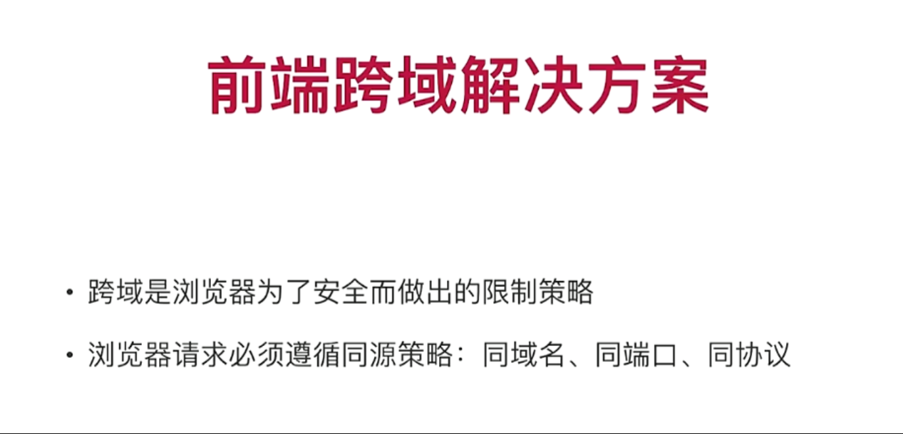

# 第一章 课程简介

## 1-1_课程导学

​	

## 1-2_Node环境的安装

Node是一套用前端语法开发的后端语言，可以把他看成java一样来看待

​	

## 1-3_Node升降级

Mac电脑上允许多个node版本存在，可以根据项目需要进行版本切换

​	

​	

# 第二章 Git安装和配置

## 2-1_Git的安装

​	

## 2-2_Git配置

​	

## 2-3 Git配置SSH公钥

创建线上仓库

​	

添加了公钥私钥，就把记住账号密码给删了，不然git不知道用谁的验证机制，到底谁生效了

但我们会发现 在git push的时候，还是要输账号密码，这是为什么呢？

因为我们用的是HTTPS的url，而不是SSH，所以用不了公钥私钥进行身份验证上传的方式，公钥本身就是用SSH去生成的

用SSH去克隆项目才能确保你的公钥是可用的

私钥是本地服务器 公钥在线上仓库

​	

## 2-4 VSCode操作Git

​	

**vscode里合并分支**

切换到需要合并的分支，ctrl shift P唤出命令行窗口 输入git merge 点击想要进行合并的分支 进行合并 合并完将暂存区的文件提交到远程仓库就OK了

​	

合并冲突在vscode中很友好 已会就不做笔记了

只需选择做咋样的保留再push上去就OK了

​	

## 2-5 Git常用命令

通过git mv命令进行文件改名 是直接在该文件进行改名 而在vscode进行文件改名（例如将 c.js 改为 d.js ）则是删除c.js文件并新增一份d.js文件

​	

​	

git log 查看日志 里面记录着历史操作

​	

为什么是 : 实际上前面是空 是空就把tag给干掉

删除的时候，git push 不写 : 会报错

​	

vi 进入后 wq 是退出

​	

checkout不止是切换分支 同时可以撤销文件操作

git checkout . 撤销所有

​	

所以到这我们知道 git revert 版本号 就是回退到该版本号的上一个版本数据，意思是把这个版本号给回退了 所以就显示该版本号的上一个版本号的数据了

​	

还有git reset命令 除了撤销回退的同时 还能抹去提交的历史记录 别人便无法追踪我们的历史提交记录了

但如果撤销的跨度太大的话 会报error冲突 这时我们可以用 git push origin demo-2 --force 来强制撤销

分支与标签在项目发布的时候用得多

​	

# 第三章 Vue Cli4.0安装和使用

## 3-1 VueCli4.0安装

VueCli 我们可以把他当成是一个插件来看待 但凡是插件 安装方式都简单 可以通过npm/yarn下载安装，但安装软件不一样例如node 而cli是插件包 但凡插件一般都会上传npm去 只要是在npm发布的 我们都可以通过npm下载安装

npm如果太慢的话 可以用cnpm，就可以不用翻墙 用的是国内的源镜像

项目用到的vuecli版本

脚手架能做什么呢？他能做很多东西，他会自动帮我们集成一些webpack的东西，帮我们构建打包编译，包括一些基本的架子包括我们入口的js，帮我们把vue的一些基本的单页面程序给它搭出来，那我们只需要填一些页面，填一些路由只需要一些插件就可以把项目跑起来。那么脚手架就等于是帮我们搭了一个基础的架构，实际上就是项目的非右架构，我们后面会讲解项目的右架构，脚手架就是我们项目的一个最基础的架构

视频中的4.0.8的vuecli版本被弃用了，安装了稍微高点的版本4.5.7

当无法覆盖安装的时候 再去卸载重新安装

​	

## 3-2 VueCli4.0使用

​	

创建项目有两种方式

1. 通过VueCli脚手架工具 使用 `vue create 项目名称(小写)` 命令来进行创建
2. 先不创建项目 而是使用 `vue ui` 命令 启动项目管理器 之后在项目管理器中创建项目 如果我们已创建了项目 就不用创建了 直接导入就行

​	

导入mall文件夹

​	

这些插件是辅助我们项目开发的 最终不会被编译到我们项目中去

​	

[老师请教一下，我这边在VueCli UI系统中输入端口号，无法终止项目-慕课网 (imooc.com)](https://coding.imooc.com/learn/questiondetail/184854.html)

​	

项目要跑起来还需要router、vuex等

一般node_moudules太大 我们都没有给它git push上去 太麻烦 不过要也可以

​	

将node_moudules和dist添加到.gitignore文件中 太大没上传 麻烦且怕远程仓库受不了

​	

## 3-3 Vue-DevTools安装使用

Vue-DevTools是浏览器vue调试的一个插件 安装有两种方式

- 一种是直接从谷歌扩展商店下载
- 一种是从github官方仓库下载后 npm build搭建（具体操作看河畔一角老师的博文）然后会生成一个chrome的文件夹 压缩后打包放到浏览器扩展程序中就可以啦！

​	

​	

# 第四章 项目基础架构

## 4-1 跨域-CORS

在控制台里的XHR请求中查看

前端要调用哪个网站进行访问，后台允许 就能调

​	

easy-mock这个网站gg了 他是允许所有人调用

网站被调用可能会不安全 我们可以设置谁可调用

​	

axios本身是一个promise的结构 所以我们可以通过.then的方式去做链式调用

​	

​	

## 4-2 跨域-JSONP

不在控制台XHR请求中，而是相当于调用一个接口 在JS

比较流行的一种方式（跨域）

前端需要安装JSONP插件

​	

jsonp不是请求 只是一段js脚本 所以访问慕课网成功 axios访问失败

​	

代理proxy还要修改服务器配置 用cors后端又不想改，所以jsonp在之前成为了最流行的一种跨域方式

jsonp请求不是一个真正的请求

​	

## 4-3 跨域-接口代理

jsonp内部封装了一个callback参数（回调函数）

vue.config.js是webpack的配置表 很重要！

devServer（配置表）

vue.config.js遵循node.js 用module.exports的方式

有空可以看看node.js的API怎么配置的

通过vue.config.js可以修改项目启动的端口

changeOrigin是否将主机口的原点更改为目标url地址

​	

什么是代理？讲一个简单例子：当你转发/A接口的时候，实际上转发的是/B接口，这就是代理

​	

vue.config.js 名字不能改

修改了配置文件信息 要重启服务器生效

​	

## 4-4 接口梳理

status不返回非0是不正常的

​	

设计稿方便我们了解设计页面有哪些，以及前端项目要怎么搭比较合理，跟后端同学对接接口结构 状态码status等等

