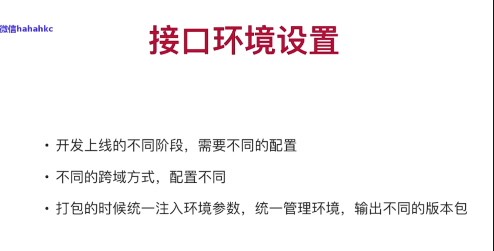
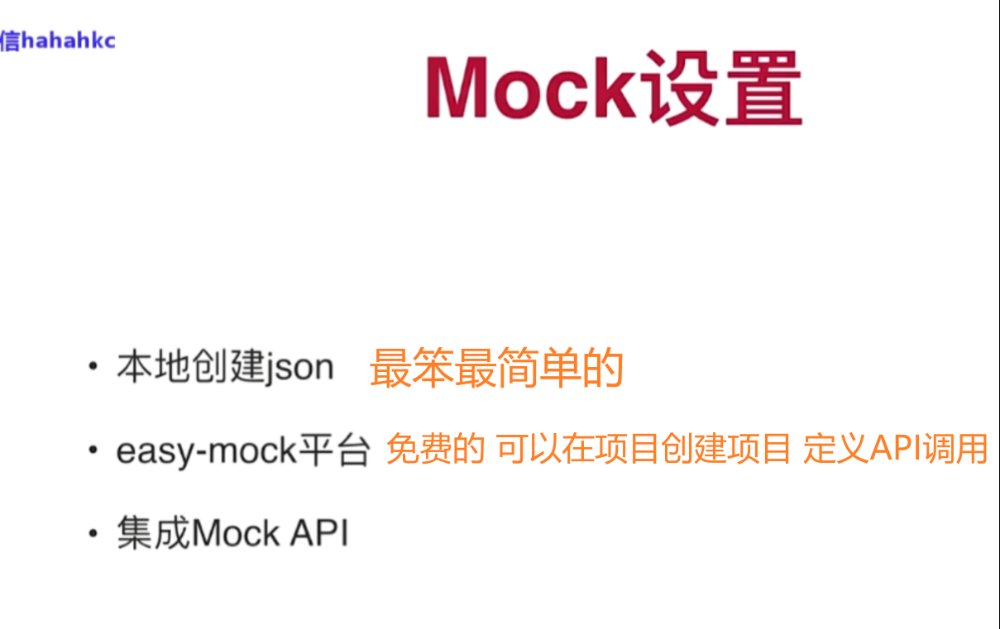

# 第一章 课程简介

## 1-1_课程导学


​	

## 1-2_Node环境的安装

Node是一套用前端语法开发的后端语言，可以把他看成java一样来看待


​	

## 1-3_Node升降级


Mac电脑上允许多个node版本存在，可以根据项目需要进行版本切换

​	

​	

# 第二章 Git安装和配置

## 2-1_Git的安装


​	

## 2-2_Git配置


​	

## 2-3 Git配置SSH公钥


创建线上仓库


​	

添加了公钥私钥，就把记住账号密码给删了，不然git不知道用谁的验证机制，到底谁生效了


但我们会发现 在git push的时候，还是要输账号密码，这是为什么呢？


因为我们用的是HTTPS的url，而不是SSH，所以用不了公钥私钥进行身份验证上传的方式，公钥本身就是用SSH去生成的

用SSH去克隆项目才能确保你的公钥是可用的

私钥是本地服务器 公钥在线上仓库

​	

## 2-4 VSCode操作Git


​	

**vscode里合并分支**


切换到需要合并的分支，ctrl shift P唤出命令行窗口 输入git merge 点击想要进行合并的分支 进行合并 合并完将暂存区的文件提交到远程仓库就OK了

​	

合并冲突在vscode中很友好 已会就不做笔记了

只需选择做咋样的保留再push上去就OK了


​	

## 2-5 Git常用命令


通过git mv命令进行文件改名 是直接在该文件进行改名 而在vscode进行文件改名（例如将 c.js 改为 d.js ）则是删除c.js文件并新增一份d.js文件

​	


​	

git log 查看日志 里面记录着历史操作

​	


为什么是 : 实际上前面是空 是空就把tag给干掉


删除的时候，git push 不写 : 会报错

​	


vi 进入后 wq 是退出

​	


checkout不止是切换分支 同时可以撤销文件操作

git checkout . 撤销所有

​	


所以到这我们知道 git revert 版本号 就是回退到该版本号的上一个版本数据，意思是把这个版本号给回退了 所以就显示该版本号的上一个版本号的数据了

​	


还有git reset命令 除了撤销回退的同时 还能抹去提交的历史记录 别人便无法追踪我们的历史提交记录了


但如果撤销的跨度太大的话 会报error冲突 这时我们可以用 git push origin demo-2 --force 来强制撤销

分支与标签在项目发布的时候用得多

​	

# 第三章 Vue Cli4.0安装和使用

## 3-1 VueCli4.0安装

VueCli 我们可以把他当成是一个插件来看待 但凡是插件 安装方式都简单 可以通过npm/yarn下载安装，但安装软件不一样例如node 而cli是插件包 但凡插件一般都会上传npm去 只要是在npm发布的 我们都可以通过npm下载安装


npm如果太慢的话 可以用cnpm，就可以不用翻墙 用的是国内的源镜像


项目用到的vuecli版本

脚手架能做什么呢？他能做很多东西，他会自动帮我们集成一些webpack的东西，帮我们构建打包编译，包括一些基本的架子包括我们入口的js，帮我们把vue的一些基本的单页面程序给它搭出来，那我们只需要填一些页面，填一些路由只需要一些插件就可以把项目跑起来。那么脚手架就等于是帮我们搭了一个基础的架构，实际上就是项目的非右架构，我们后面会讲解项目的右架构，脚手架就是我们项目的一个最基础的架构


视频中的4.0.8的vuecli版本被弃用了，安装了稍微高点的版本4.5.7

当无法覆盖安装的时候 再去卸载重新安装

​	

## 3-2 VueCli4.0使用


​	

创建项目有两种方式

1. 通过VueCli脚手架工具 使用 `vue create 项目名称(小写)` 命令来进行创建
2. 先不创建项目 而是使用 `vue ui` 命令 启动项目管理器 之后在项目管理器中创建项目 如果我们已创建了项目 就不用创建了 直接导入就行

​	

导入mall文件夹


​	

这些插件是辅助我们项目开发的 最终不会被编译到我们项目中去


​	

[老师请教一下，我这边在VueCli UI系统中输入端口号，无法终止项目-慕课网 (imooc.com)](https://coding.imooc.com/learn/questiondetail/184854.html)


​	

项目要跑起来还需要router、vuex等

一般node_moudules太大 我们都没有给它git push上去 太麻烦 不过要也可以


​	


将node_moudules和dist添加到.gitignore文件中 太大没上传 麻烦且怕远程仓库受不了

​	

## 3-3 Vue-DevTools安装使用

Vue-DevTools是浏览器vue调试的一个插件 安装有两种方式

- 一种是直接从谷歌扩展商店下载
- 一种是从github官方仓库下载后 npm build搭建（具体操作看河畔一角老师的博文）然后会生成一个chrome的文件夹 压缩后打包放到浏览器扩展程序中就可以啦！

​	

​	

# 第四章 项目基础架构

## 4-1 跨域-CORS

在控制台里的XHR请求中查看


前端要调用哪个网站进行访问，后台允许 就能调

​	


easy-mock这个网站gg了 他是允许所有人调用

网站被调用可能会不安全 我们可以设置谁可调用

​	


axios本身是一个promise的结构 所以我们可以通过.then的方式去做链式调用

​	


​	

## 4-2 跨域-JSONP

不在控制台XHR请求中，而是相当于调用一个接口 在JS

比较流行的一种方式（跨域）


前端需要安装JSONP插件


​	

jsonp不是请求 只是一段js脚本 所以访问慕课网成功 axios访问失败


​	

代理proxy还要修改服务器配置 用cors后端又不想改，所以jsonp在之前成为了最流行的一种跨域方式

jsonp请求不是一个真正的请求

```vue
<script>
// import HelloWorld from './components/HelloWorld.vue'
// import axios from 'axios'
import jsonp from 'jsonp'

export default {
  name: 'app',
  components: {

  },
  data(){
    return{
      
    }
  },
  mounted(){
    let url = '/api/activity/servicetime'
    // axios本身是一个promise的结构 所以我们可以通过.then的方式去做链式调用
    // axios.get(url).then(()=>{
      
    // })
    jsonp(url,(err, res)=>{
      let result = res;
      this.data = result;
    })

  }
}
</script>
```

​	

## 4-3 跨域-接口代理


jsonp内部封装了一个callback参数（回调函数）

vue.config.js是webpack的配置表 很重要！

devServer（配置表）

vue.config.js遵循node.js 用module.exports的方式

有空可以看看node.js的API怎么配置的

通过vue.config.js可以修改项目启动的端口

changeOrigin是否将主机口的原点更改为目标url地址

​	

什么是代理？讲一个简单例子：当你转发/A接口的时候，实际上转发的是/B接口，这就是代理

​	

vue.config.js 名字不能改

修改了配置文件信息 要重启服务器生效

​	

## 4-4 接口梳理


status不返回非0是不正常的

​	

设计稿方便我们了解设计页面有哪些，以及前端项目要怎么搭比较合理，跟后端同学对接接口结构 状态码status等等


​	

## 4-5 目录结构设置

```api
这里建议把大图片放在public里面 把小图片放在assets里面

api接口文件夹 index.js 放我们整个项目的api请求 地址统一管理

util index.js 格式化 文字/数字转换 把公共方法放util里面去

storage 是我们前端用的比较频繁的 他是我们数据存储的对象 index.js 怎么去存值取值删除值

因为我们项目会用到vuex 所以我们建一个store文件夹 vuex后面会详细讲解 这里到时候会分几层级结构

路由看情况 文件多就建个router文件夹 文件只有一个就直接建router.js

建一个pages index.vue是我们的首页
```

---

大概项目雏形就如上所述 其实还有环境变量的设置 等讲到环境变量的时候再进行讲解设置

任何项目结构都不是一成不变 根据业务情况（增加/减少）进行微调，现在是根据设计稿和以往经验搭一个雏形

​	

## 4-6 基本插件介绍


​	

```html
6.失败的一天 一天没学习 出现是scss错误知道是在哪里了，在App.vue中的style样式 scope引入scss 但并没有先npm install 导致 found not module
7.安装插件小合集：
npm install vue-lazyload@1.3.3 --save-dev
npm install element-ui@2.13.0 --save-dev
8.四、没有清理缓存
每次装包失败报错后记得都要 npm uninstall xxx 清除装包错误留下的缓存。
比如 npm i -D node-sass 报错了，就要执行一遍 npm uninstall node-sass，然后再重新安装。
9.sudo是mac下输入密码验证身份的命令，因此windows用户应该是以管理员身份运行命令行工具，然后删除sudo即可。
举个例子：删除版本mac下是sudo n rm 版本号，windows下应该是n rm 版本号。
10.npm install node-sass@4.13.0 --save-dev
11.今日mvp！！！！！！！！！！！
【npm install node-sass死活安装不上，最后终于搞定】
https://blog.csdn.net/wk964269669/article/details/72845651?spm=1001.2101.3001.6650.1&utm_medium=distribute.pc_relevant.none-task-blog-2%7Edefault%7ECTRLIST%7ERate-1-72845651-blog-125441010.pc_relevant_multi_platform_whitelistv6&depth_1-utm_source=distribute.pc_relevant.none-task-blog-2%7Edefault%7ECTRLIST%7ERate-1-72845651-blog-125441010.pc_relevant_multi_platform_whitelistv6&utm_relevant_index=2
```

​	

https://tdesign.tencent.com/starter/vue/#/dashboard/base


​	

起飞！如何用nvm控制版本nodejs 下方两篇文章教学

[将nodejs的高版本降级为低版本（切换node版本）](https://juejin.cn/post/7094576504243224612)

[nvm安装，nvm use 一直报错exit status 1 或 exit status 145 问题？](https://wuhou.fun/390.html)

​	

今日mvp！！

[npm install node-sass死活安装不上，最后终于搞定](https://blog.csdn.net/wk964269669/article/details/72845651?spm=1001.2101.3001.6650.1&utm_medium=distribute.pc_relevant.none-task-blog-2%7Edefault%7ECTRLIST%7ERate-1-72845651-blog-125441010.pc_relevant_multi_platform_whitelistv6&depth_1-utm_source=distribute.pc_relevant.none-task-blog-2%7Edefault%7ECTRLIST%7ERate-1-72845651-blog-125441010.pc_relevant_multi_platform_whitelistv6&utm_relevant_index=2)

​	


​	

​	

## 4-7 路由封装

主要是对router.js与组件的编辑配置

routes 配置子路由/路由列表

​	

## 4-8 Storage封装


现在后端的些报文会放到前端存储 导致cookie可能有点不够用了 cookie设置了它的域名、规定时间、路径，然后把cookie值存进去，然后cookie会发送到服务器端

所以cookie针对大段报文来说 用storage比较好

cookie有规定时间 例如有效期7天/30天过期等等，过期之后要重新登录而   localStorage不会，localStorage在浏览器端存储（存本地unit存储里了） ，sessionStorage是绘画技术，sessionStorage是在浏览器里面存的，浏览器关闭就没了

​	

例如这里就是前端发送给服务器的，这就是前端发送给服务器的cookie技术，而这个发送不是我们手动去发送的，而是服务器自动去浏览器端的cookie，自动发送给服务端


sessionStorage也是存储内存中的

cookie有路径限制 例如写在./A下面 ./B下就看不到这个cookie了

而Storage是没有这种限制的，例如写在https://www.csdn.net/这个根路径（域名）中，不管在哪里子路径都可以看到这个Storage

cookie的API稍微模糊一些，通过document.cookie去设置它的域名他的规定时间它有点路径等等，不像Storage 我们可以写个值 例如setItem keyvalue一个非常清晰的keyvalue去帮助我们存储它的值

以上便是cookie和Storage的关系与区别

而localStorage和sessionStorage也讲了区别，localStorage是本地unit存储 而sessionStorage是内存存储 sessionStorage会随着浏览器关闭而关闭，而localStorage不会 这是他们一些区别和联系


注意规范的使用 给webpack用的是config的规范例如vue.config.js 给代码项目用的是es6的规范


操作key一个就够了 别写一堆

​	

## 4-9 接口错误拦截


**统一报错**

错误 是底层（给开发者看）传递给业务层（给客户看），业务层报错信息由前端负责展示

**未登录统一拦截**

权限问题 例如未登录账号要查看订单 这肯定是不允许的

**请求值、返回值统一处理**

例如将时间的规范改为以时间戳的形式返回

​	

- axios.get()传参用params

- axios.post()传参就直接是写参数 不用params

* 也有复合的写法

​	

同时发多个请求用axios.all，因为一个网页一次可能有几个请求，一次请求一个loading 开关开关效果体验很差 所以用axios.all来一次性接收多个请求


请求接口地址和域名不是同一个地址就需要配置baseURL 如果不配置他的话 需要在每一个接口写一个完整的接口地址

timeout是操作时间 一般是设置5-8秒

headers可传可不传

import包养成一个习惯 把插件放上面 把组件放下面

axios我们在每个页面都要写这个名字 还要导入他 很麻烦

vue-axios是把他这个作用域对象挂载到vue实例上面去 方便我们用js去调用


interceptors 拦截器 用来拦截信息

​	


response是axios插件封装给我们的，它并不代表接口返回给我们的值，response.data才是取到我们接口的值，而这个data（人家里面的值就叫data）是axios内部做一层封装，这些都是有规范的

response.data.data才是我们接口返回的值

路由像这种有#的 /#/ 就是哈希路由

接口域名和前端域名一样称为接口代理 一样的话baseURL不用写完整 直接写/api

后端接口都没加/api，可能觉得稍微有点麻烦，但没关系我们前端的话可以处理，我们在转发的时候可以把api干掉

​	


​	

## 4-10 接口环境设置

代理方式是最简单最安全的方式



跨域方式不同 配置不同，baseURL的书写也不一样 出了问题难当责任，所以我们这节课把环境封装成一个模块 统一进行管理

多了解一下webpack的基本配置信息 打包


​	

switch (process.env.NODE_ENV) { // process.env.NODE_ENV可以获取--mode（package.json）传递过来的参数（环境变量） 可以去node.js官方文档查阅相关知识点，而为什么我们可以取到nodejs的环境变量呢？因为我们项目本身就是在node的服务器运行起来的

接口代理的配置信息可以在vue.config.js中修改

本节重点讲环境变量怎么去配置


有两点需要大家注意 我们--mode的参数不能随便写，开发环境只能叫development、生产环境只能叫production 要自定义也可以 待会讲


正确写法如下图 不然报 找不到依赖错误


​	


更换测试环境（环境设置）

如果我们在建的时候 test不生效，可以建一个 .env.test 将环境变量注入进去 （因为有时一些配置信息不生效）


然后这样的话他就可以加载成功了


prev 是预发布版本

​	

## 4-11 Mock设置（1) (2）

Mock就是模拟数据

前端开发的工作有两步

1. 做网页开发
2. 做数据交互

跟前后端对接联调就是交互，我们发起一个请求，能把数据拿回来

将静态的做成动态的


交互在后期需要和后端同学进行交互，包括接口联调，提示、上预发布等等，在开发阶段 后端同学也在开发阶段，同时处于开发阶段 Mock就起到作用了 因为我们只有接口文档 还没有开发完成 所以此时Mock就起到一个非常重要的作用了 它可以提前帮助我们接口给搭建好 就好比接口人员已经把接口搭建好了

将Mock独立出来 可以灵活插拔 数据可删可减

​	



easy-mock的话是开源项目 极力推荐的方式是从github clone源码下来 自己在公司内部搭建一套easy-mock平台 不然线上的因为免费 人一多带宽就不够 容易垮掉

集成Mock API 等于是把这个mock的server放到我们前端的项目里面去 变相的去作为中间层的代理和拦截 然后把返回值返回给我们


因为public是根目录所以直接写mock就好了，因为我们访问的是一个json静态文件 所以用axios获取 发送给浏览器 浏览器接收后便可以显示给我们看 像这样我们访问项目的其他静态文件 也是可以访问到的

```html
二、导致304状态码的原因如下：

(1)页面长时间不更新：

如果页面内容长时间不更新，如静态页面，基本上直接返回304个状态码，即使动态页面内容不变，也会出现这个问题。

(2)CDN缓存

当你打开cdn加速时，即使你的内容页面发生了变化，但是cdn的缓存没有更新，也可能导致这个问题。面对这个问题，你可能需要设置cdn定期更新时间，但这与百度快照不更新不同。
```


开启就好了 停用缓存 每次重新加载文件 返回的状态码就是200 而不是304

​	


可以使用mockjs生成模拟数据（多条），不用我们自己手写，所以可以花时间学习一下mockjs的语法

https://www.npmjs.com/

http://mockjs.com/

https://github.com/nuysoft/Mock/wiki/Getting-Started

比较推荐上面方法学mockjs 

easy-mock学习成本比mockjs大

​	

import和require的区别


import是预编译加载，意思是你编译的时候 import的这个文件就会被加载进来，就会被写入内存当中，但是require不会，require是你在从上到下执行的时候，才去加载的 如果你mock是false的话 它是不会被加载进来的


我们如果是import mockjs在main.js中的话 mockjs被预编译加载 那么编译的时候就会被加载进来 那么你发请求就会永远被它拦截了 而我们是不希望永远被拦截的 我们希望当你mock开关打开的时候才会被拦截 当你关闭的时候就不会被拦截

这样在后期扩张维护的时候也很轻松，加工加模块也容易

mock.js的数据模拟制造能力一级！后台数据有时故意搞null 不如mock.js


==要设置断点才能查看结果啦~==


​	

在这里学习mock语法


​	


easy-mock 新建项目 写json 生成mock数据 贴回这里


​	

**小结**


```html
本地创建json后期需要改请求的接口地址

easy-mock平台只需要我们自己在上面创建项目，根本就不需要安装插件 那么就可以集成进来了 而且后期没什么污染 我们只需要把代码给它注释掉就好了；唯一的缺点就是容易垮掉容易宕机 毕竟免费

集成Mock API 就是通过import方式 通过npm 安装依赖 最后集成到项目中去，我们相当于是把这个server搬到我们这个项目里面来了

优先推荐easy-mock，但前提是公司自己有搭建easy-mock平台，如果没有的话就集成mock API比较好 最后才是本地json
```

​	

# 第五章 商城首页

## 5-1 Nav-Header组件

### （1）实现顶部导航条功能

第四章主要讲的是架构部分 要二刷到时候 吸收不完全

基本上做网页开发的都要提供一份reset.scss ，reset其实没什么东西 只是针对我们网页的内置的样式把他覆盖掉 像我们的body、div、p、h1标签 他本身浏览器有一些内置样式 这也就是为什么有的时候我们写h1会发现它有边框有边距 那是因为浏览器内置给它一个默认的样式 我们需要把这个默认的样式给它干掉 一般我们会设置margin: 0; padding: 0; outline: none;

响应式的网页 大小随着分辨率的变化而变化大小 成本会提高很多

我们做网站做网页的时候，一定要给我们网页做一个**安全距离** 防止页面挤压变形不好看，还有合理性（屏幕分辨率不同 网页显示也不同） 设置一个最小的宽度，不要超过这个宽度，设置margin：auto居中就好了

网页字体最小像素就是12px

把常规字体大小和颜色提取出来放到congif.scss

scss的好处就是预编译 可以提前定义变量 通过加载变量的方式去动态实现一个样式的这个功能

​	

宽度不需要设置 因为你分辨率不一样 大家一定不要设置宽度 宽度它不管多宽 那只要是我们有安全距离就可以了

基本我们很多东西都是放在我们容器container里面去的

一般我们防止我们页面刷新的话 我们会在 <a href=""></a>的href中写`javascript:;` 这样页面就不会刷新 否则的话我们页面会刷新

一般我们高度和行高都是一样的

scss的好处就是语法可以进行嵌套而不用统计，而我们css是不能进行嵌套的

css是采用缩进的形式来规定样式的父子级 编写样式

​	


左右两边有边距 是浏览器内置的默认样式问题 我们只需要引入前面的scss的rest.scss到App.vue就行了


因为div是块级元素 所以下面的元素会被挤下来

我们一般用no-repeat来控制填充

​	

### （2）实现导航菜单

### （3）实现导航菜单


把通用的样式给它抽离出来 封装在base.scss文件里 当我们用到该class样式时，会默认加载该base.scss文件已定义的样式


- base放的是我们一些公共机制

* config放的是我们一些基本配置信息

* reset是覆盖我们浏览器默认的样式设置

​	


flex布局可以控制图标 不然有时可能不会居中

​	


​	

mixin是完美scss系统非常重要的一部分，它可以把这个变量抽离出来，甚至可以把一些样式定义成方法，把公共部分提取出来


@mixin真的强大 封装成函数 复用性强 ts也是

​	


注意单位也要传


当我们团队达到四五人七八人的时候呢，你会发现这种方式需要一个专人去维护我们的mixin，专门去搞我们的项目架构，搞我们的这个公共机制，那么给各个组员呢，提供这个便利

​	

> 头部菜单到这里也就基本开发完毕了~

​	

### （4）实现导航栏下拉功能

循环用ul标签最合适，因为li标签刚好是一个对称结构 可以无限循环下去 这里的话 li就是每一个商品

target=“_blank” 打开新窗口

图片的话 宽和高只能设置一边 这样才会等比例缩放 如果宽高都定死了话 图片会被压缩

a标签是行内元素，a没给display:inline-block 撑不开

font-weight:bold 是加粗 但也可以不给bold给具体数值(100-800)

大家可以习惯性的 比如说有些样式你在前期不确定的话呢 你可以直接再浏览器上面右键审核元素这边去调 调好之后呢 你把它拷过去也可以删它 这样你可以发现文字和图片都同时居中了


​	

定义伪类没生效的原因：没content占位！

子元素加了绝对定位 父元素可能需要加相对定位 位置才是正确的

​	

### （5）动态的交互|过滤器|用户登录判断

mounted-我们需要初始化调用我们的一个方法

methods-第一个就是获取我们的手机列表、商品列表

axios用get()方法传参的话 用params传参，post请求的话就直接写

要懂得怎么调试，network是看我们报文的，xhr看我们请求

开发阶段用mock 联调的时候就不能用mock啦，要真实的接口地址


如果状态码是404 可能是我们改了配置信息 例如vue.config.js 修改了接口地址但没有重启服务

然后我们会发现请求网址多了个/api 但实际上我们接口是没有/api的，这个/api是我们前端自己加上去的，我们希望所有接口都是/api开头，这样的话方便我们自己管理，因为我们希望做一些拦截等等


然后congif里会将path的/api置为空，把它覆盖掉

​	

数据请求了之后就是数据的渲染了

建议大家v-for 加个:key key渲染速度更快，而且后期的话复用力更高些，你在重复二次渲染的话呢它会自动缓存，就不用再重复渲染了，直接去取，当然了数据量大的时候才体现得出来 数据量小的话完全没感觉 你加跟不加没什么区别

vue1.0 filters是内置的，2.0及以后就要手写了，没内置

像金额/日期格式化 都会用到我们的过滤器

​	

vue3.x中过滤器已弃用

在 3.x 中，过滤器已删除，不再支持。相反地，我们建议用方法调用或计算属性替换它们。

[[vue/no-deprecated-filter] Filters are deprecated.](https://blog.csdn.net/HGGshiwo/article/details/119753259)


同样可以实现

​	

> 小结一下：本节课学习了下拉元素加上动画过渡以及我们动态的交互，包括一些过滤器功能和用户是否登录判断


​	

## 5-6 Navfooter开发

a的优先级是大于你父级的优先级的，所以颜色设置不生效，所以我们需要再给a定义一个值

​	

## 5-7  Service-Bar组件

服务条组件

scoped代表的是局部的意思，只有当前组件才会被渲染，可能样式是全局的样式，有可能会对其样式产生影响

​	

## 5-8 首页轮播功能实现

> import 'swiper/dist/css/swiper.css'

我们通过npm去安装依赖插件的时候，这个插件和样式都是一块放的，插件一般的话会有一个地址，每个插件npm包确实内部也会通过这个run build去打包，打包完之后的源代码呢，都是放在dist里面去的，所以说我们直接通过swiper/dist 去引用它。而且我们可以发现当前路径下没有这个东西，那么它会自动的去我们这个node model的模块里面去查找


有一些数据为空是为了全方位测试我们的功能

一层一层往下定样式是防止串用，影响其他样式

默认值为true的话，可加可不加

<!-- 因为slot在vue3.x中被弃用了，新增v-slot(可简写为#) v-slot插槽只能在template中使用且不能被div包裹-->

```html
9月28日 【Ben】

遇到的问题
【问题】
1.github里SPA是什么意思？
2.API是什么？

【解决】
1.SPA: 单页应用
2.就是很多关于我们这个插件里面的具体的配置参数都在里面，教程是什么？就是别人有写好的demo来告诉我们怎么去用，大家可以参考demo，别人demo怎么去写的，一般我们是先看教程，先看demo别人怎么去开发怎么去使用，然后当你做的时候，你的功能比别人的功能更复杂，那么这个时候可能它的demo太过于简单，那么这个时候你就需要参考API文档了，因为API文档写的更加详细，毕竟教程里面的demo都是只用到了几个API，你的功能更复杂，那么你就需要花更多的时间去参考里面更多的这种API文档，别人的demo不可能把所有的参数都列出来，这也不太现实。如果你的功能足够复杂，你就一定要花时间去看里面的API的每一个参数干什么用的

今日小结
1.【小米商城】学习了xxx
2.【小米商城】5-7看到了第xx集
3.大家一定要学会看文档 知道怎么去集成我们里面这个插件的一些选项和语法
```


​	

## 5-9 首页轮播菜单实现（1）

height没有生效，可以通过改变我们的核模型来解决，核模型分w3c和IE 核模型

标准核模型的高度是不包括我们的padding值的，而当你把核模型指定为border-box的时候。它的高度是包括padding值的，也就不会超出设置的height了


> 伪类符号是&: 不是$:

我们单纯想要让背景变透明，背景上的文字是不想变透明的，那么我们便不能使用opacity了，不然文字也会一起变透明 opacity会把里面的所有的元素都加一个透明度 甚至连字和图标全部都有透明度

### （2）左侧菜单展开

 为什么二次菜单加transition: all .5s;没有效果反映呢？

> 9.29: 因为hover的是从display:none变为block，要用opacity从0-1才有动画效果（我觉得是错的）

​	

## 5-11 首页广告位实现

:href需要通过字符串来拼接路由

懒加载 减轻我们前端服务器的带宽压力

​	

## 5-12  手机商品实现(1)

flex弹性布局，弹性布局基本上可以解决很多问题，可以避免一些浏览器插件问题引起的麻烦，而且是可以自动排列

描述信息我们一般会用p标签来描述


加 vertical-align:middle; 可以让图片和文字都居中

cursor是鼠标光标的意思

#### (2)

span是行内元素 加不上背景颜色，大小是被字给撑开的，需要设置成inline-block

​	

## 5-14 Model组件实现


