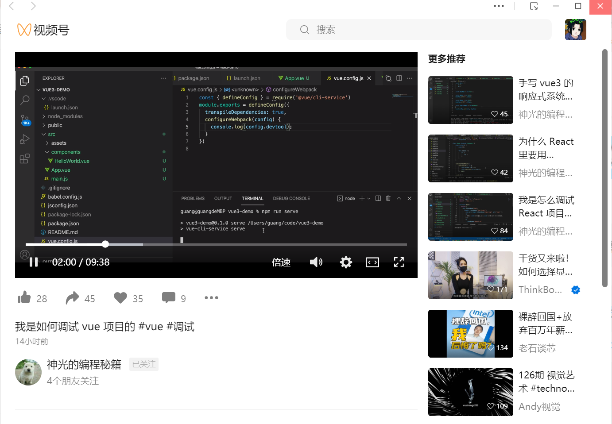

# MiMall-小米商城

小米商城是 [front-end_learning ](https://github.com/Benn314/front-end_learning)的一个vue3子项目

​	

**学习进度汇报模板**

```apl
x月xx日 【Ben】

遇到的问题
Xxxxxx

今日小结
1.【小米商城】学习了xxx
2.【小米商城】看到了第xx集
3.xxx

明日计划
1.【小米商城】学到第xx集
```

​	

**Bug汇集**

1. xxx
2. xxx
3. xxx

​	

**分支学习路线**

- [游戏开发教程 | 零基础也可以用18堂课自制一款3D小游戏 | Cocos Creator 3D](https://www.bilibili.com/video/BV1AE411j7L9/?is_story_h5=false&p=1&share_from=ugc&share_medium=iphone&share_plat=ios&share_session_id=20B30FCA-7955-4266-B07A-E20BF803EA3F&share_source=WEIXIN&share_tag=s_i&timestamp=1664010873&unique_k=s0kySGv&vd_source=1f9072e850dde202d6ddd4c60d9d334d)

- 

​	

小楷每日天气推送以及报平安提醒—网站链接🔗

- [【每日推送云平台】](http://www.xiezedong.top)

- [微信公众平台-测试号](https://mp.weixin.qq.com/debug/cgi-bin/sandboxinfo?action=showinfo&t=sandbox/index)

​	

- [区块链，智能合约 & 全栈 Web3 开发](https://github.com/smartcontractkit/full-blockchain-solidity-course-js)
- [资深前端工程师带你领略前端工程之美：研发过程前端工程](https://www.bilibili.com/video/BV1hB4y1n7rD/?spm_id_from=333.788&vd_source=1f9072e850dde202d6ddd4c60d9d334d)
- [Full Tutorial Udacity - Data Structures and Algorithms](https://www.youtube.com/watch?v=unaweoIeYxQ&list=PLvOhoWQ5P66HFzpQXO3HZxBtc8n2aB_9v)

