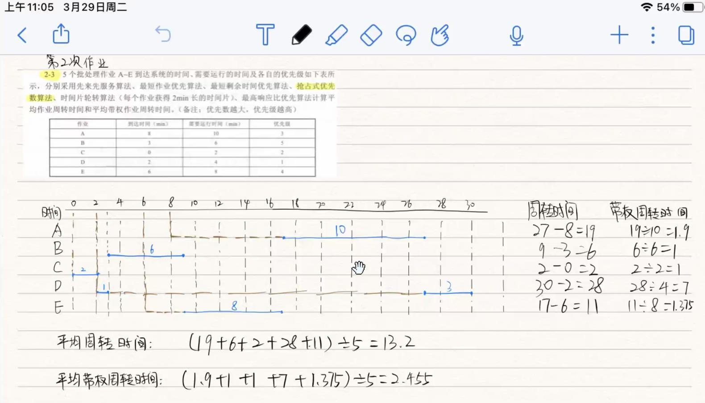
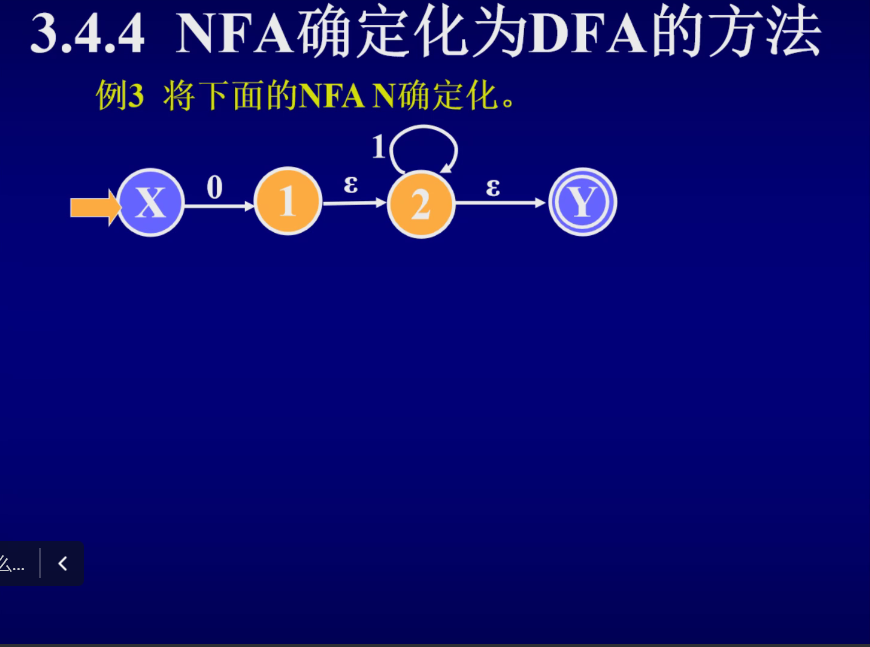
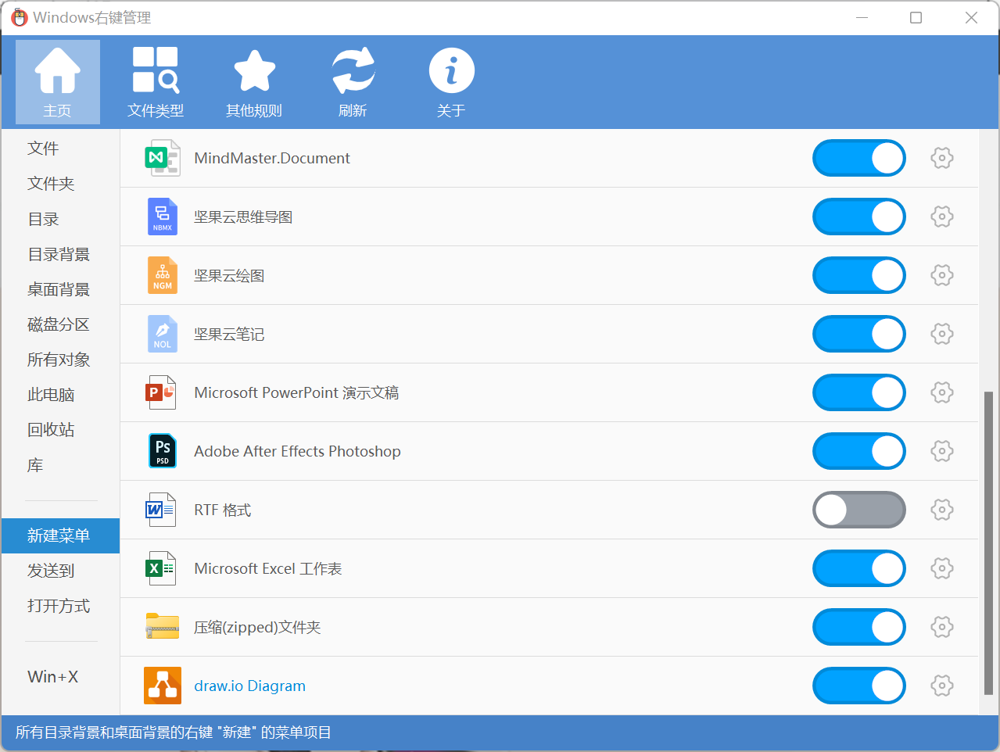
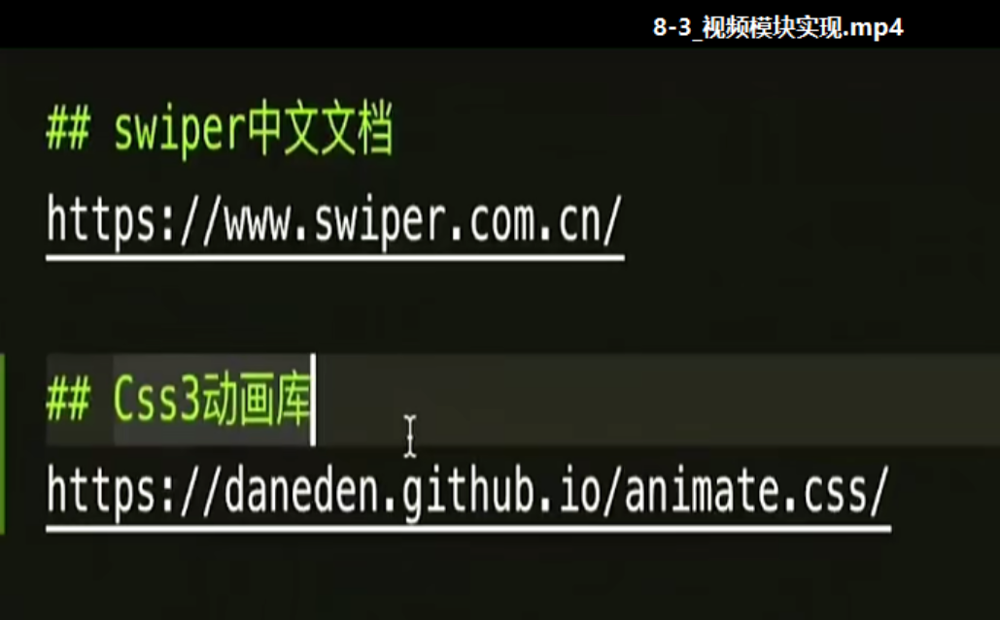
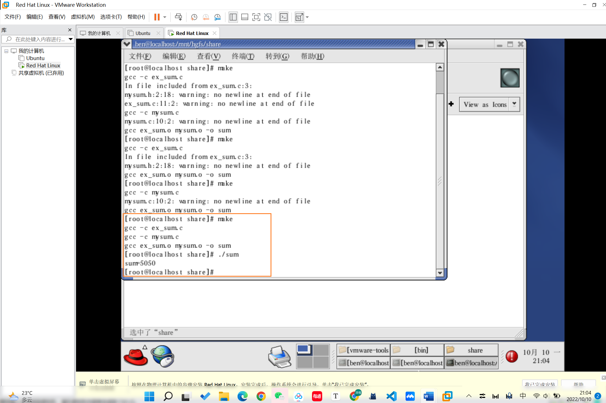

```html
10月10日 【Ben】

遇到的问题
【问题】
1.【ESLint】禁止使用 空格 和 tab 混合缩进 (no-mixed-spaces-and-tabs)
2. vue3 destroyed 被弃用 （The `destroyed` lifecycle hook is deprecated. Use `unmounted` instead vue/no-deprecated-destroyed-lifecycle）
3. vue3.0 `slot` attributes are deprecated.`slot`属性已弃用

【解决】
1.配置文件中的 "extends": "eslint:recommended" 属性启用了此规则。
大多数代码约定要求使用空格或 tab 进行缩进。因此，一行代码同时混有 tab 缩进和空格缩进，通常是错误的。
Rule Details
该规则禁止使用 空格 和 tab 混合缩进。
2.The `destroyed` lifecycle hook is deprecated. Use `unmounted` instead  vue/no-deprecated-destroyed-lifecycle
vue3.0中：
    - destroyed 生命周期选项被重命名为 unmounted
    - beforeDestroy 生命周期选项被重命名为 beforeUnmount
3.<!-- slot 在vue3被弃用 vue2.0写法 -->
<div class="swiper-pagination"  slot="pagination"></div>
<!-- vue3.0写法 -->
<template v-slot="pagination">
	<div class="swiper-pagination"></div>
</template>

今日小结
1.【小米商城】学习了组件吸顶实现、视频模块实现、Slide动画实现
2.【小米商城】8-2看到了8-5
3.ctrl K 快速添加超链接🔗 先复制网址 使用快捷键时会自动填充链接 只需再填写网址说明即可
4.显卡坞是个好东西

明日计划
1.【小米商城】学到10-3
```

​	

参考文章

1. [vue3 destroyed 被弃用 （The `destroyed` lifecycle hook is deprecated. Use `unmounted` instead vue/no-deprecated-destroyed-lifecycle）](https://www.cnblogs.com/aknife/p/14917814.html)
2. [禁止使用 空格 和 tab 混合缩进 (no-mixed-spaces-and-tabs)](https://cn.eslint.org/docs/rules/no-mixed-spaces-and-tabs)
3. [解决vue3中slot提示已经废弃的问题](https://blog.csdn.net/xiaoguang44/article/details/125544504?spm=1001.2101.3001.6650.3&utm_medium=distribute.pc_relevant.none-task-blog-2%7Edefault%7ECTRLIST%7ERate-3-125544504-blog-118978631.t0_edu_mix&depth_1-utm_source=distribute.pc_relevant.none-task-blog-2%7Edefault%7ECTRLIST%7ERate-3-125544504-blog-118978631.t0_edu_mix&utm_relevant_index=4)
4. [在项目中CR是什么意思?](https://blog.csdn.net/a1809032425/article/details/115293545)

插件推荐


​	





​	

新加个右键新建drawio



​	



​	


​	


​	


./是执行结果

