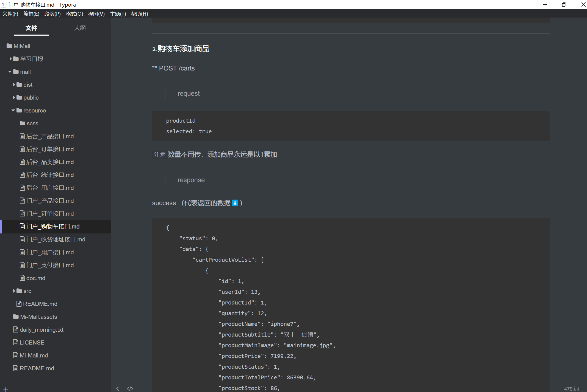

```html
10月11日 【Ben】

遇到的问题
【问题】
1.goole一下浏览器审查元素的XHR具体是什么？
2.Proxy error: Could not proxy request /products?categoryId=100012&pageSize=6 from localhost:8080 to http://mall-pre.springboot.cn.
See https://nodejs.org/api/errors.html#errors_common_system_errors for more information (ENOTFOUND).
3.!important优先级是最高吗？忘了
4.购物车列表订单渲染不出 对其进行检查

【解决】
1.
2.代理错误 我出现错误的原因：没联网 拉取不到服务器的接口信息
3.
4.	① 检查拼写
	② 是否有地方遗漏
	③ 切换为写死数据的版本 进行元素审查 对比
	④ 后发现是多设置了一个@click="toggleAll" 但没有定义methods：toggleAll() 删除 编译运行 成功！
小结：因为好多次错误都是处在拼写上的错误，所以第一时间习惯性检查单词是否拼写有误 其实应该先看控制台有没有打印错误信息的 拼写错误也可以从控制台体现出来 养成有错误先看控制台信息的习惯
第二，确实有拼写错误 [Vue warn]: Property or method "checkedNum" is not defined on the instance but referenced during render. Make sure that this property is reactive, either in the data option, or for class-based components, by initializing the property
data(){}中的checkedNum [√] 错误拼写成checkNum [×]

今日小结
1.【小米商城】学习了产品站交互实现、商品详情交互实现、Order-Header组件、购物车列表渲染
2.【小米商城】8-6看到了10-2
3.9-1建议二刷

明日计划
1.【小米商城】学到11-1
```

​	

success下代表返回的数据




