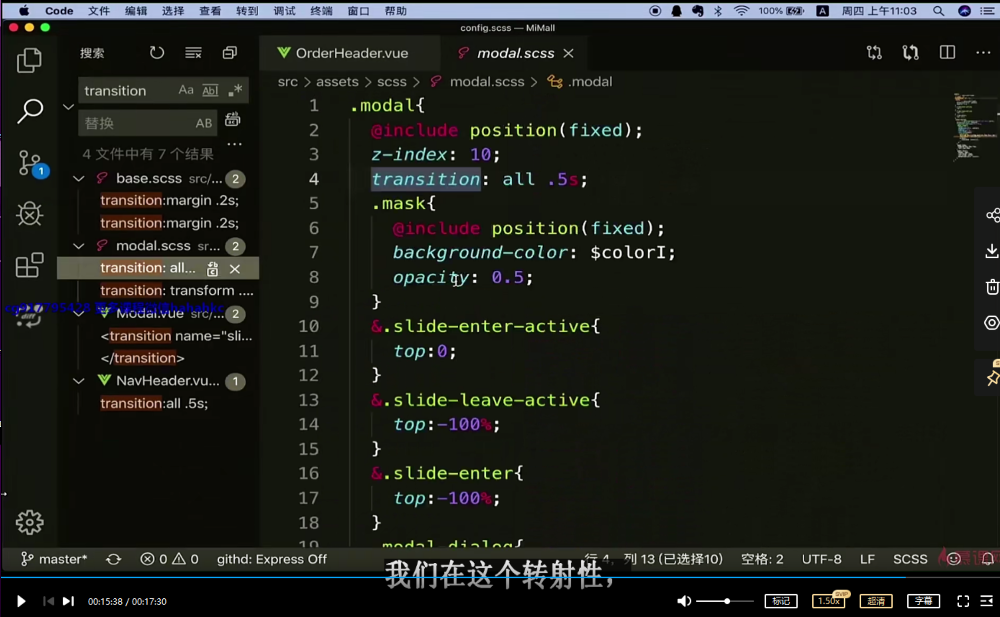
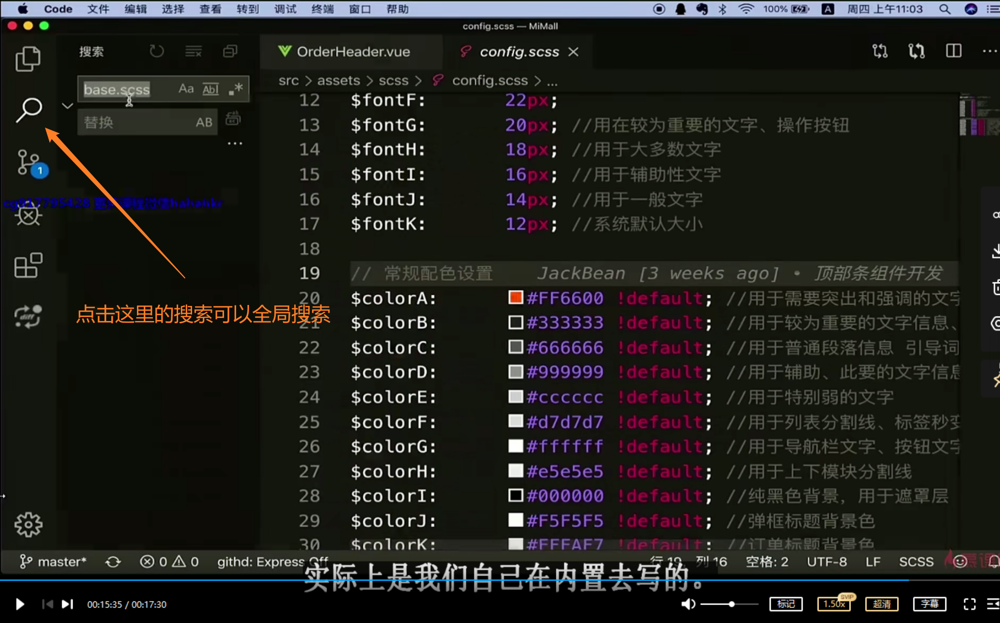

```html
10月12日 【Ben】

遇到的问题
【问题】
1.解决分页器pagination无法显示
2.element-ui是饿了么的 查一下支付宝的ui框架是什么 都可以学习一下 增加广度
3.多了一个.babelrc npm run serve项目启动会报错服了 建议看一下网上的文章先了解一下（参考文章在10月13日.md）

【解决】
1.正确写法：
<!-- v-slot可缩写为# -->
<template #pagination>
    <div class="swiper-pagination"></div>
</template>
之前可能是延迟导致的效果不显示 误以为书写错误

今日小结
1.【小米商城】学习了购物车全选和非全选、购物车商品更新和删除、购物车结算、ElementUI入门梳理
2.【小米商城】10-3看到了11-1
3.小结一下 能力提升three Keyframe√
    1).看不懂报错信息
    2).不知道怎么调试
    3).不懂如何打断点
4.11-1 ElementUI入门梳理 建议二刷 看ElementUI官方文档的时候可以看一遍

明日计划
1.【小米商城】学到12-1
```

​	

ElementUI官方文档

- [Vue3 Element UI](https://element-plus.gitee.io/zh-CN/)

- [Vue2 Element UI](https://element.eleme.cn/#/zh-CN)

​	

操作系统作业题

[操作系统原理与Linux实践教程申丰山版习题2的2-3答案](https://blog.csdn.net/weixin_44579433/article/details/102791009)

​	

这种全局查找是怎么搞的



