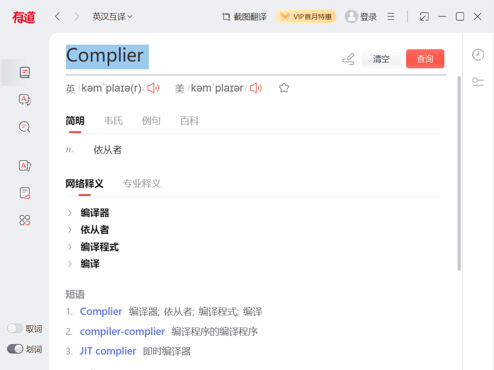
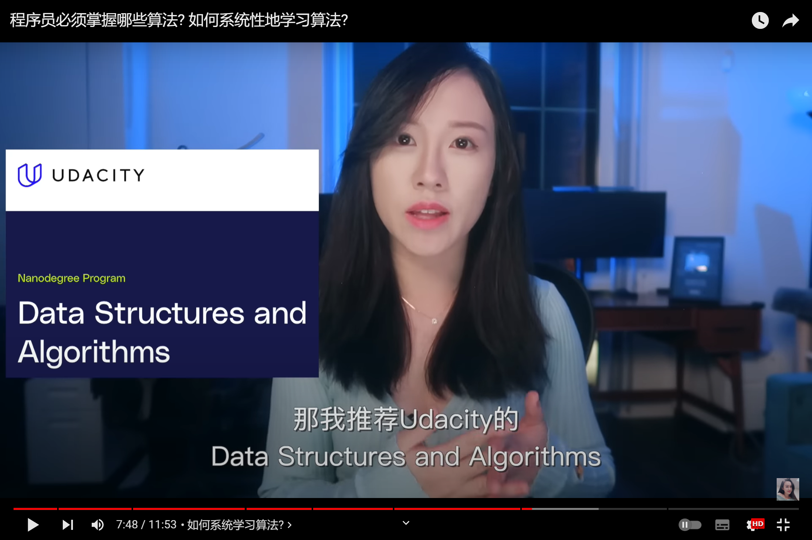
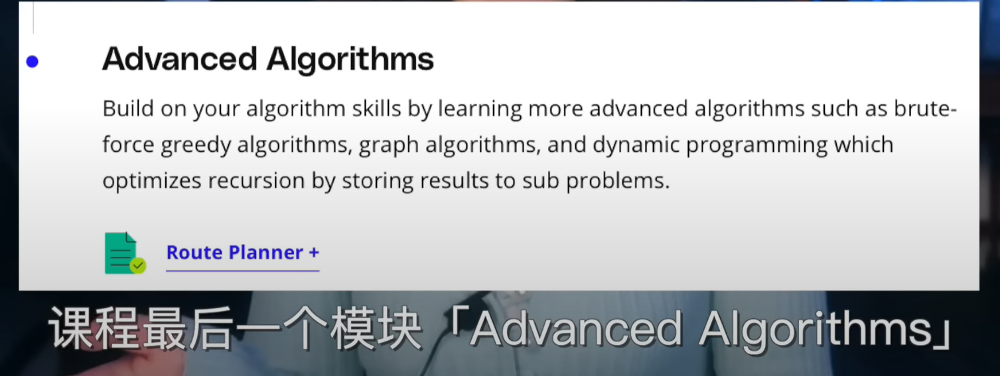
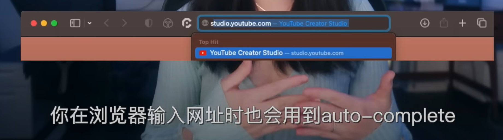
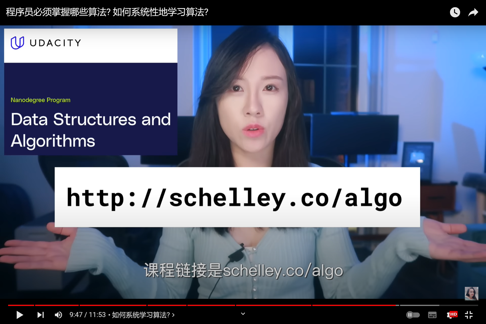
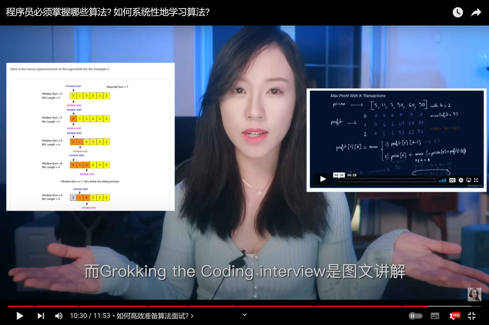

```html
10月14日 【Ben】

遇到的问题
【问题】
1.引入element ui后，刷新页面总是会弹出提示框

【解决】
在element.js中把 Vue.use(Message) 改成 Vue.component(Message.name, Message)就可以了


今日小结
1.【小米商城】学习了退出功能实现
2.【小米商城】11-4看到了第xx集
3.xxx

明日计划
1.【小米商城】学到13-1
```

​	

引入element ui后，刷新页面总是会弹出提示框


参考文章

[引入element ui后，刷新页面总是会弹出提示框](https://blog.csdn.net/weixin_49427896/article/details/115834212)

graph 图





这门课讲解带中文字幕的 课程最大的特色 是带你做一系列高质量的算法实战项目 



会用到A*算法 实现Google Map导航的核心功能Router planner router planner项目 含金量和深度要远超美国很多高校算法课的final project 把这种项目放到简历 在求职市场会更容易脱颖而出

学到Data Structures模块 他会带你实现一个blockchain区块链 也就是比特币的核心技术

学到Basic Algorithms模块 你会实现Google Search的auto-complete 也就是搜索引擎的自动补全功能 不仅在搜索引擎





​	

算法进阶（面试）


二者区别




