```html
10月17日 【Ben】

遇到的问题
Xxxxxx

今日小结
1.【小米商城】学习了xxx
2.【小米商城】13-4看到了第xx集
3.stylesheet 样式表
4.link标签中的rel 表示“关系 (relationship) ”
5.可以看到在浏览器的标签头上面显示了一个图标，这个图标也就是我们常说的favicon.ico.
6.【红宝书】0-2.1.3 P15 异步执行脚本

明日计划
1.【小米商城】学到第xx集
```

​	

**参考文章**

[关于favicon.ico的两三事](https://www.cnblogs.com/LoveJenny/archive/2012/05/22/2512683.html)


​	

---

红宝书路线第三集

set里面没有重复数据 下面看一个面试题

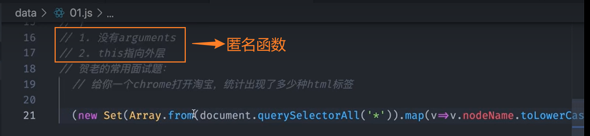


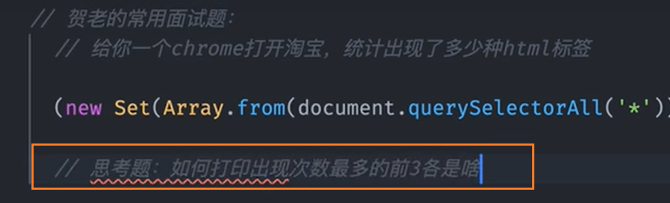

第四集

节流与防抖

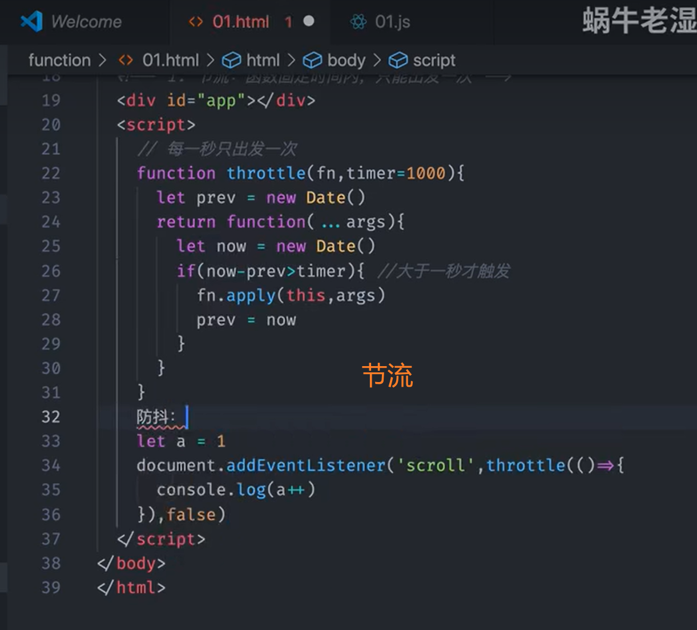

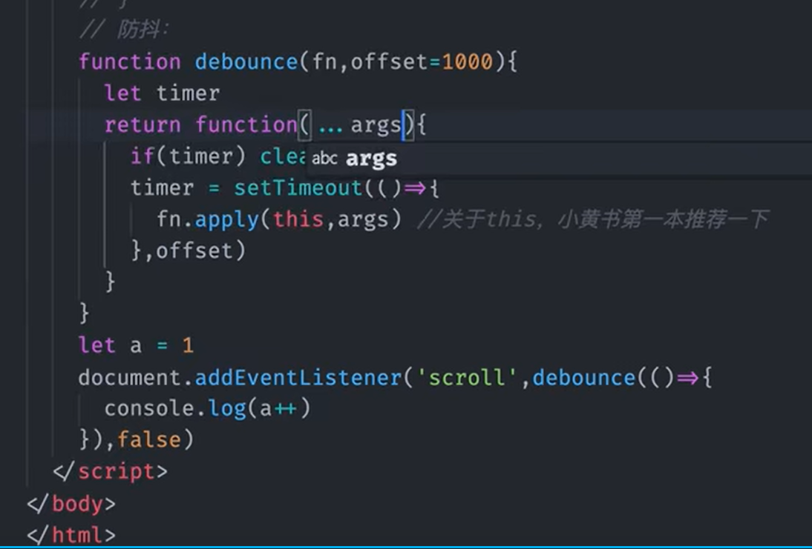

---

​	

- [ ] 编译原理作业

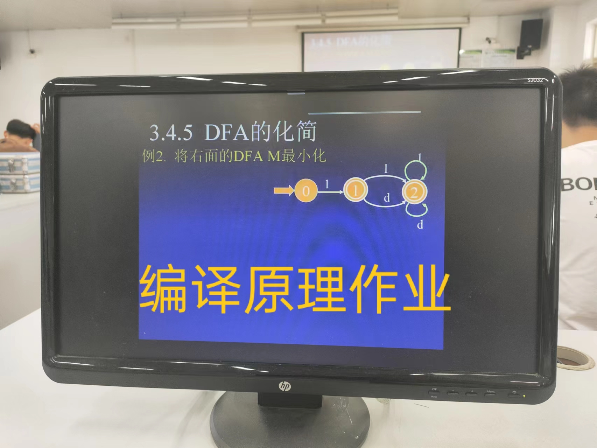


​	


这玩意它收费。。$99 see you!

观看视频进度

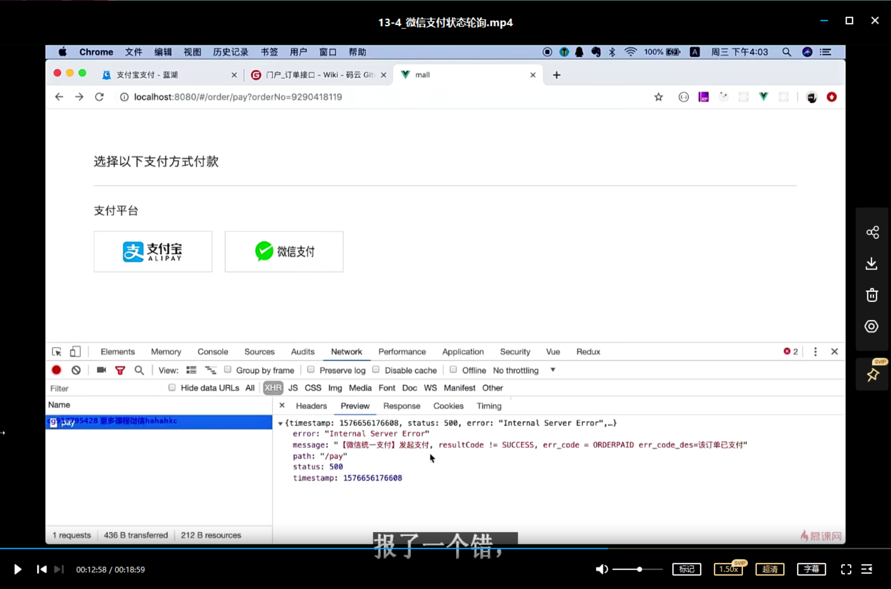

​	

`ctrl alt T` 是打开Ubuntu的终端

关于makefile的make命令 交叉编译当前目录下的所有.o文件

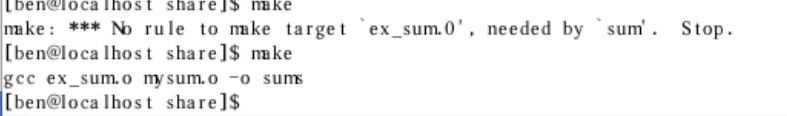

​	

---

# 红宝书路线

## 红宝书

有些章节并不是第一遍就要通读，例如第18章第一遍可以直接略过(它是独立的内容)
第二有些章节需要简化去阅读，例如第二章
第三 有些章节需要打乱顺序去阅读，第四，，七，九章(阅读vue3/react源码进度也会很快) 第一遍别死磕
第四 有些需要代码负责理解 例如第11章promise 如果能手写一个promise 理解会很快

### 1 倔强青铜

像js历史，位运算 第一遍都不需要深究

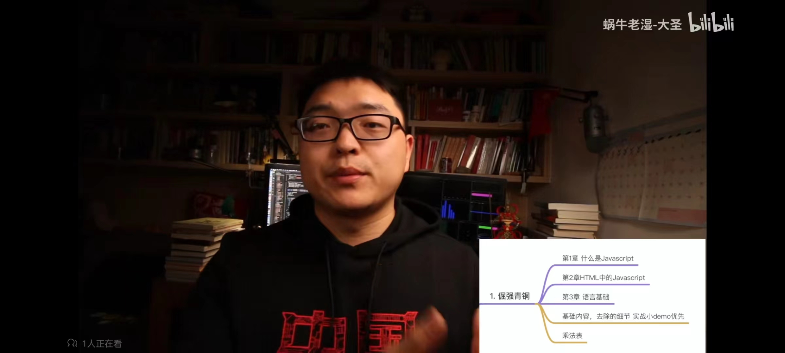

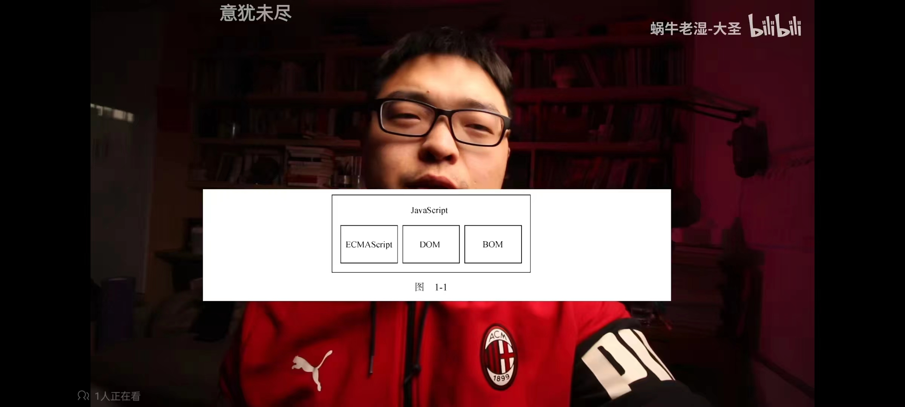

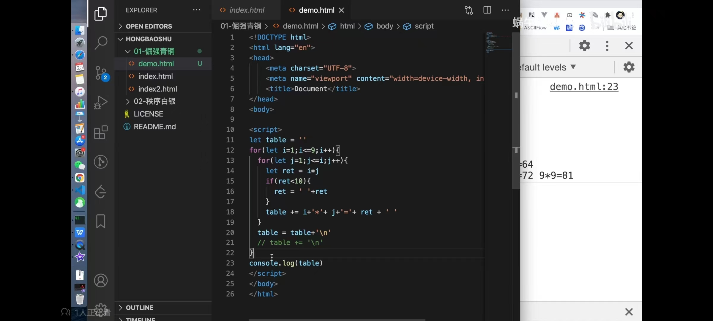

​	

### 2 秩序白银

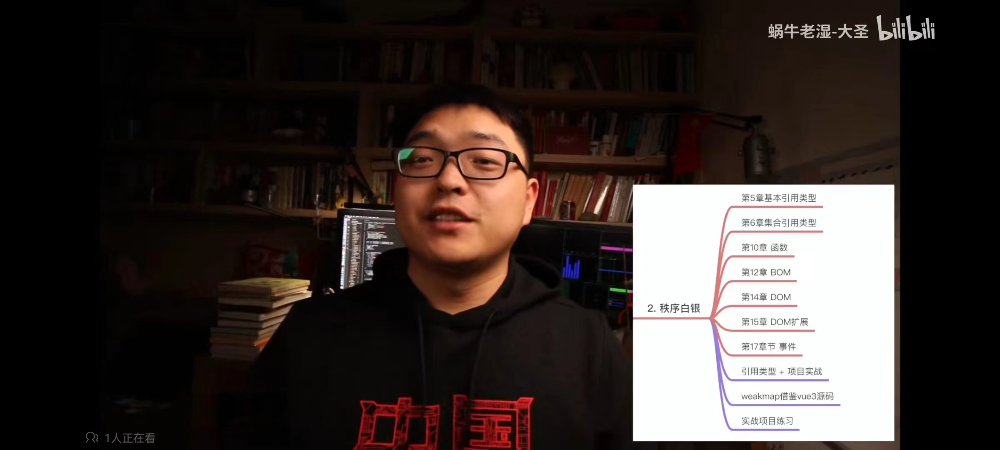

项目驱动-todolist和vue3源码来帮助学习掌握
math函数库记住这个图片就好了

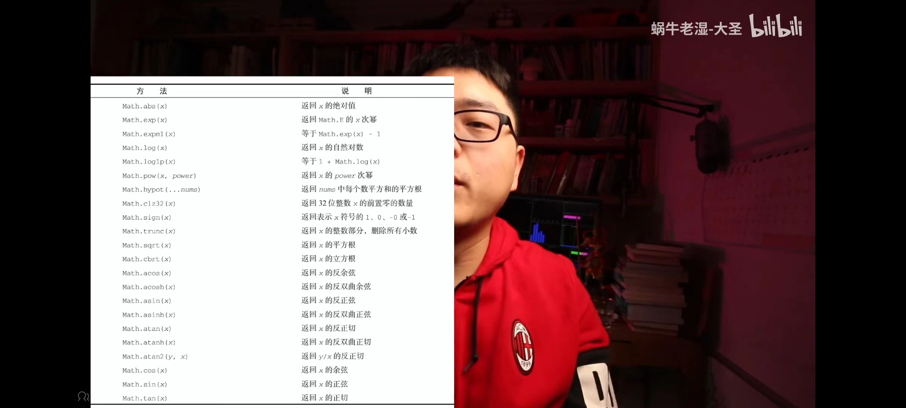

clock实现

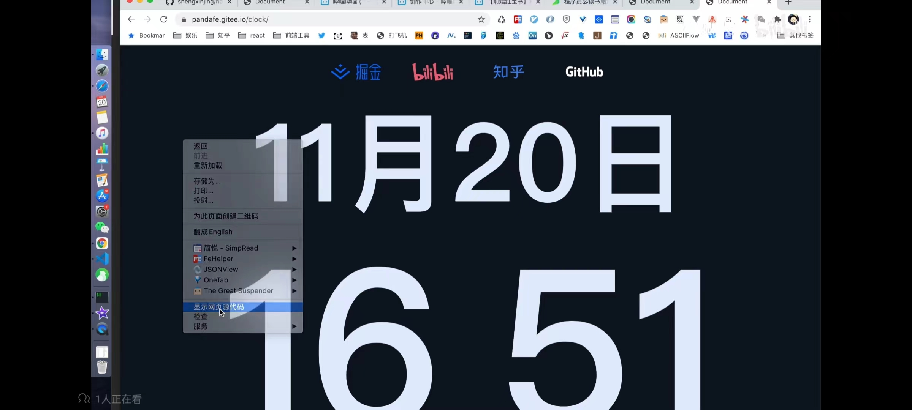

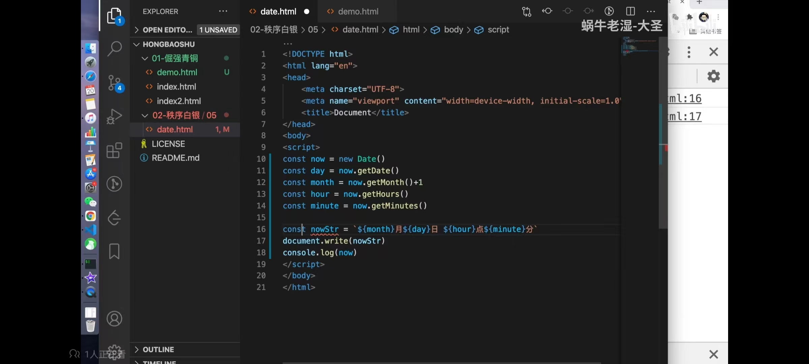

​	

### 3 荣耀黄金

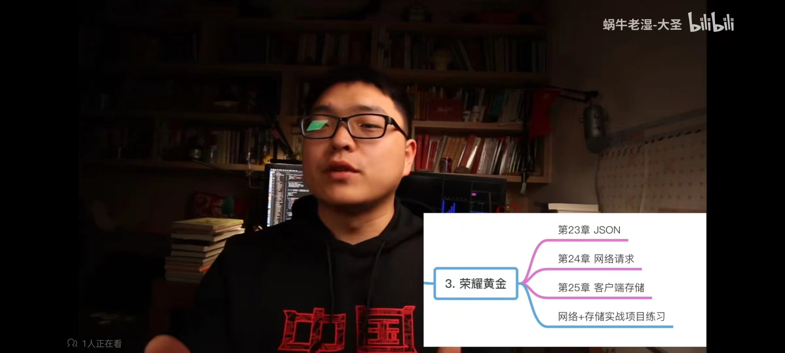

​	

### 4 尊贵铂金

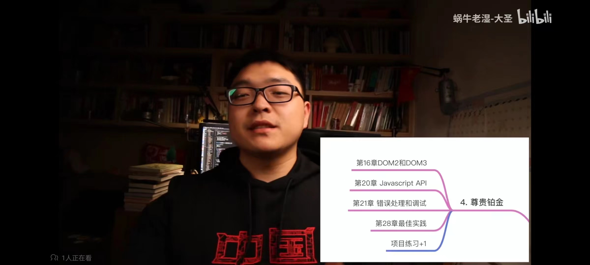

升级todolist demo 通过dom和api

​	

### 5 永恒钻石

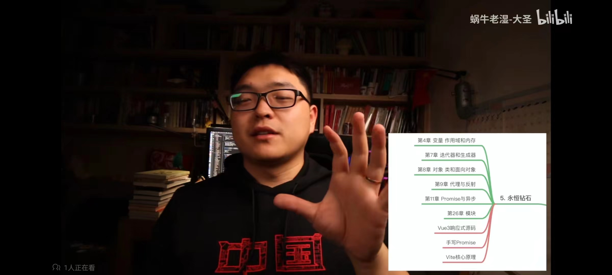

​	

### 6 Other

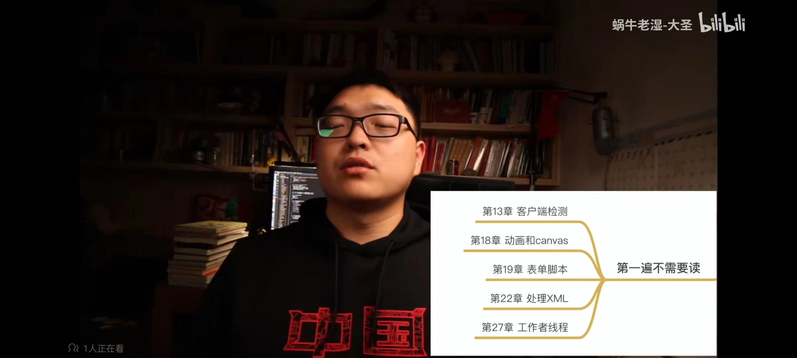

正则可以看这个


set 没有重复数据的Array