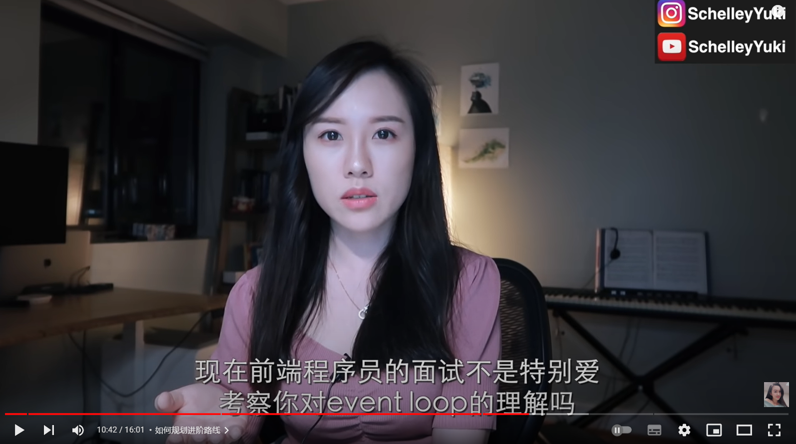

```html
10月17日 【Ben】

遇到的问题
Xxxxxx

今日小结
1.【小米商城】学习了xxx
2.【小米商城】13-4看到了第xx集
3.xxx

明日计划
1.【小米商城】学到第xx集
```

​	

---

红宝书路线第三集

set里面没有重复数据 下面看一个面试题


第四集

节流与防抖


---

​	

- [ ] 编译原理作业


​	




这玩意它收费。。$99 see you!

观看视频进度


​	

`ctrl alt T` 是打开Ubuntu的终端