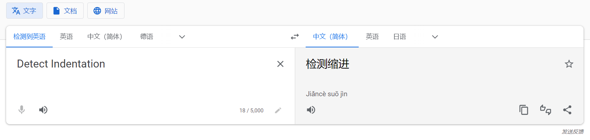
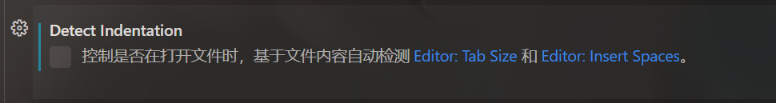
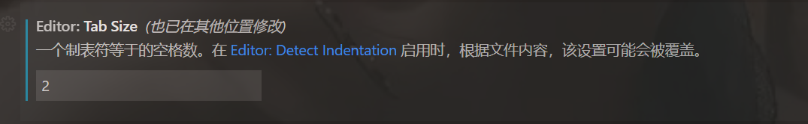

```html
10月18日 【Ben】

遇到的问题
【问题】
1.vscode设置tab size无效

【解决】
1.设置的搜索框输入 tabsize。搜索框下方显示一个Editor：Tab Size 设置输入框，把里面的数字修改2即可。
如果vscode设置tab size无效无反应，设置搜索框继续搜索 detectIndentation，找到 Editor: Detect Indentation，如果有打勾，去掉，保证不自动检测

今日小结
1.【小米商城】学习了xxx
2.【小米商城】14-1看到了第xx集
3. margin:50px 0; //上下50px 左右是0
4. 使用ctrl F进行查找 按enter是切换到下一个查找的值
5. 发现又一快捷键 CAPS锁定大写可以锁定反引号 ``

明日计划
1.【小米商城】学到第xx集
```

​	





