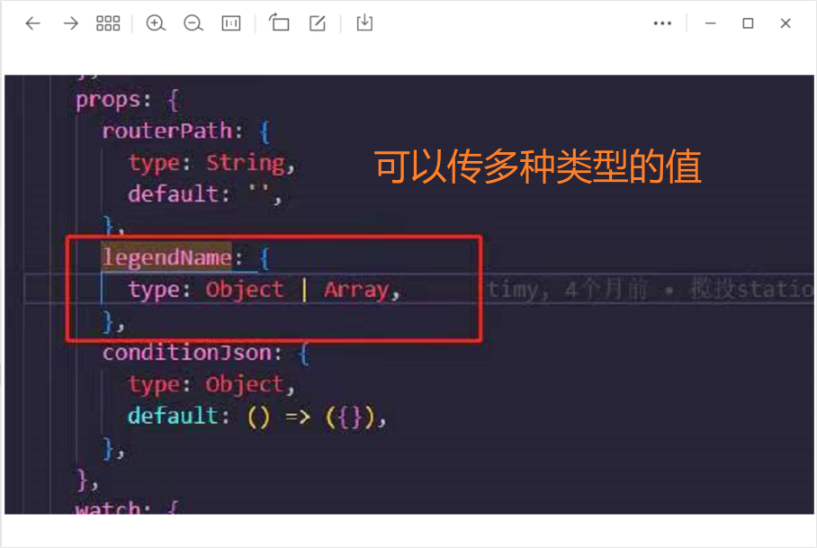

```html
10月19日 【Ben】

遇到的问题
Xxxxxx

今日小结
1.【小米商城】学习了删除预加载 真正按需、服务器部署准备工作、Nginx安装和配置、Node环境搭建、项目部署、课程总结
2.【小米商城】15-5看到了16-1
3.xxx

明日计划
1.【Promise】学到P16
```

​	

参考文章

[浅谈CMD和win powershell的区别](https://blog.csdn.net/qq_29166327/article/details/79461748)

[配置一个漂亮的Windows PowerShell](https://www.youtube.com/watch?v=YCxTjW48qDM) （有3集）

​	

