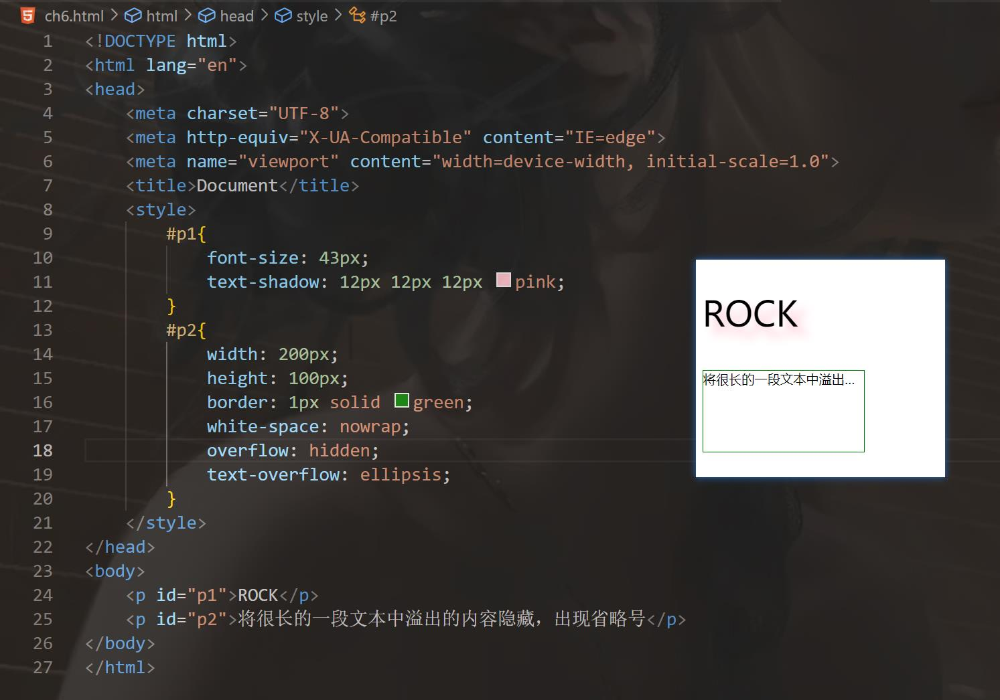

```html
10月8日 【Ben】

遇到的问题
【问题】
1./login直接点击登录 【网络】录制日志没有login日志 直接点击登录可以直接跳转 不用输入账号密码 没有任何操作

【解决】
1.main.js里的mock开关被打开 所以无法调用用户接口数据 使用本地模拟数据导致失败！
const mock = true; // true要改成false！！

今日小结
1.【小米商城】学习了xxx
2.【小米商城】看到了第xx集
3.xxx

明日计划
1.【小米商城】学到第xx集
```

​	

**ch6.html**

```html
<!DOCTYPE html>
<html lang="en">
<head>
    <meta charset="UTF-8">
    <meta http-equiv="X-UA-Compatible" content="IE=edge">
    <meta name="viewport" content="width=device-width, initial-scale=1.0">
    <title>Document</title>
    <style>
        #p1{
            font-size: 43px;
            text-shadow: 12px 12px 12px pink;
        }
        #p2{
            width: 200px;
            height: 100px;
            border: 1px solid green;
            white-space: nowrap;
            overflow: hidden;
            text-overflow: ellipsis;
        }
    </style>
</head>
<body>
    <p id="p1">ROCK</p>
    <p id="p2">将很长的一段文本中溢出的内容隐藏，出现省略号</p>
</body>
</html>
```




