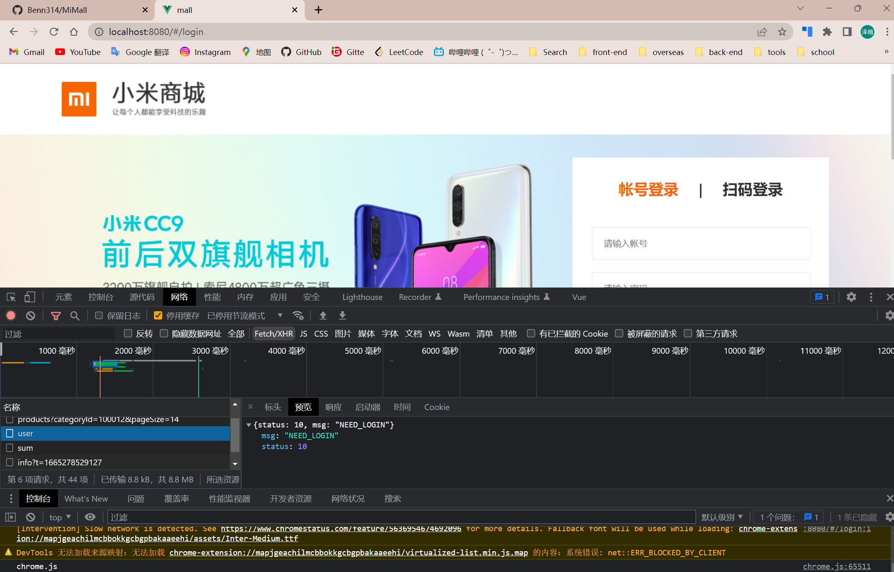
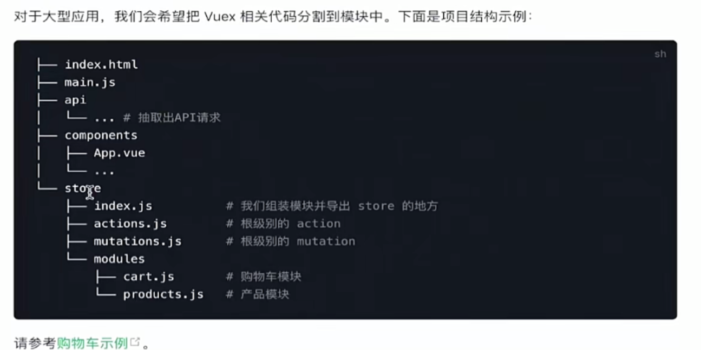
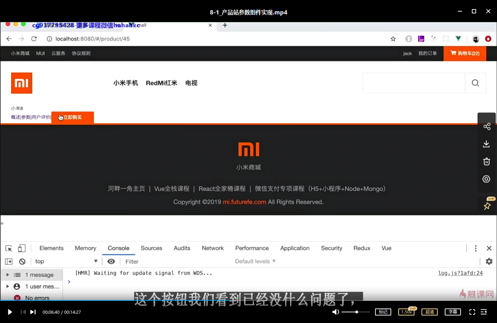
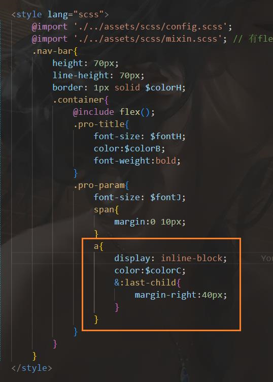

```html
10月9日 【Ben】

遇到的问题
【问题】
1.在没有判断哈希路由是否为path != '#/index' 时，进入/index（或其他子网页）且状态码不为10 不会自动跳转到login页面
2.之前不小心遗留的一个小bug ProductParam.vue绑定到Product.vue中 ProductParam中template的信息无法被显示 已知是路径动态路由的问题 例如localhost/#/product45
3.index首页的NavHeader.vue中class="item-menu"的电视产品图片无法加载出来
4.为什么这里a标签转行内块设置margin不生效呢？（图在下面）

【解决】
1.通过查找【网络】日志 预览中看到有登录数据缓存 导致status不是10 所以不会跳转 我们可以在【应用】中找到cookie下的http://localhost:8080 将影响到的缓存删除（或者全删除）即可成功跳转
2.动态路由绑定时粗心写漏了一个/在product和45之间 【ctrl F】 “product” 在./pages/index.vue中搜索补齐写漏的地方
3. '/' 和 '\' 的运用问题
 src这里的imgs\nav-img\nav-1.png是字符串
 v-lazy这里的imgs\\nav-img\\nav-3-3.png是变量 所以需要加''转化为字符串 嵌套引号的\需要再加一个\转义 所以嵌套引号用\\表示\
  如果不想转义  嵌套引号中用 / 表示 \\ 也就是转义后字符串 \
4.因为后面还插了个slot last-child后面不能有兄弟结点 用last-of-type就行

今日小结
1.【小米商城】学习了拉取用户信息、Vuex集成、产品站参数组件实现
2.【小米商城】6-2看到了8-1

明日计划
1.【小米商城】学到8-6
```

​	

[:last-of-type MDN Web Docs](https://developer.mozilla.org/en-US/docs/Web/CSS/:last-of-type)

​	



​	

目录树状结构是怎么做出来的？



​	

当前视频进度



​	




