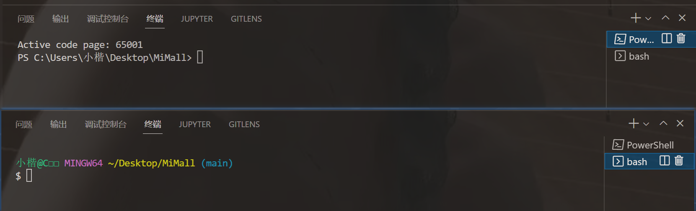
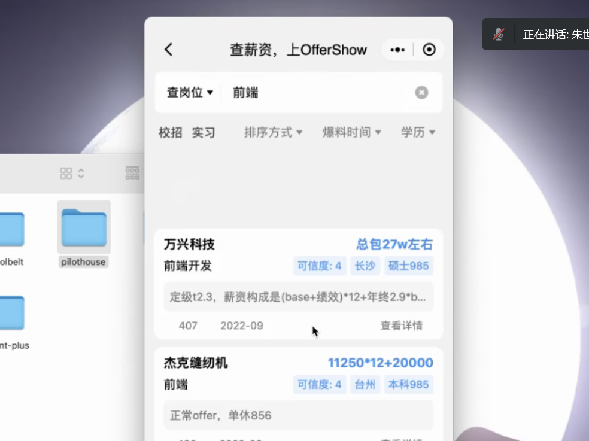
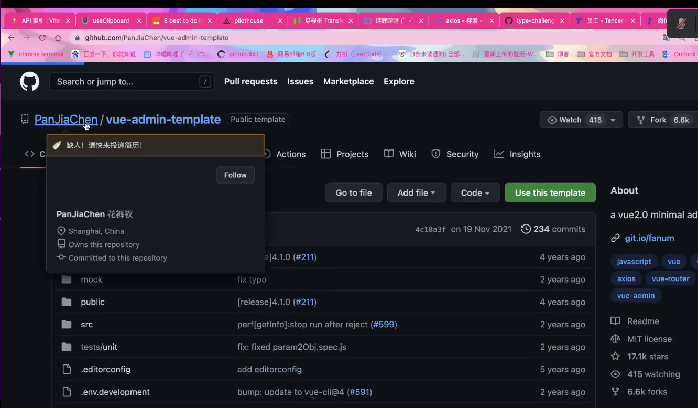
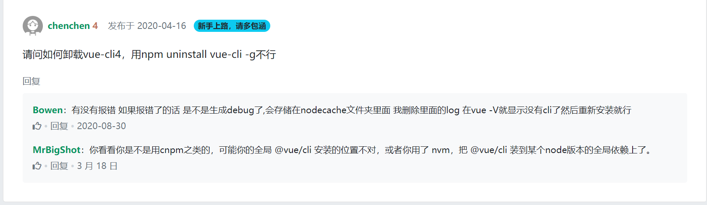
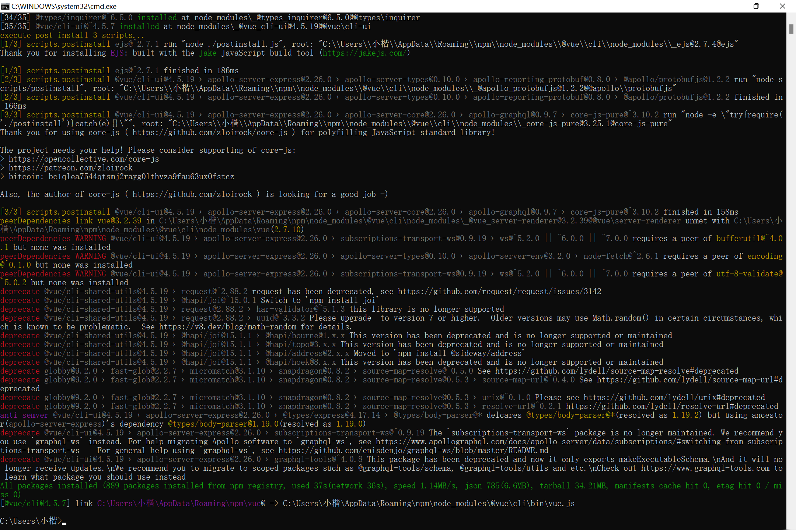

```html
9月17日 【Ben】

遇到的问题
无

今日小结
1.【小米商城】学习了Node的安装与升降机、Git、VueCli4.0安装
2.【小米商城】1-1看到了3-1
3.做一下【去哪儿网】的项目演示视频
4.通过git clone下载到本地仓库 会自动创建.git文件并remote绑定clone的在线仓库url，这样就不用自己手动git init和git remote 很方便
5.打开md文件，在typora里会显示该文件和他的父文件目录以及他本身的兄弟文件，所以我们可以把笔记的md文件建在根目录下，这样可以方便的打开整个项目文件夹
6.在vscode的终端可以直接打开git bash！！我这个大冤种！
7.难受了 小米商城带来lei的教训 先教用HTTPS的url git clone到本地，然后告诉你这是不行的，要用SSH的url才能使用公钥私钥，你直接说这有个坑就好了，为什么要让我跳下去再爬出来 给我难忘的回忆呢[emo/doge]
8.【插件推荐】git history diff 但可惜 我有gitlens了
9.ctrl P是搜索文件  ctrl F是搜索当前文件内的内容
10.ctrl shift P是打开命令行
11.git init 把项目变为一个git项目 （初始化git项目）
12."时间是弹性的，“我没有时间” 其实就是在说 “这个事情优先级不高”。我们不是通过节省时间来打造我们想过的生活，我们应该先建立我们想要的生活，时间就会自然而然节省出来"

明日计划
1.【小米商城】学到4-2
```

[MatlabR2018aWin 安装教程 （附文件）](https://blog.csdn.net/weixin_45322373/article/details/122565250)

[广州新华学院2021届毕业生就业质量年度报告](http://js.bysjy.com.cn/default/quality_report/pdf.html?fileUrl=https://yun-campus-res.oss-cn-shenzhen.aliyuncs.com/document/1640941769-3160.pdf)

[「CSS思维」组件化VS原子化](https://zhuanlan.zhihu.com/p/39476410)

​	



​	



OfferShow 找工作

​	

**原子化与组件化**

```css
// 原子化样式书写方式
fs_24 {
  font-size:24px;
}
cl_red {
  color:red;
}
bg_green {
  background:green;
}
<div class="fs_24 cl_red bg_green">原子化样式书写方式</div>
 
//组件化样式书写方式
.box { 
  font-size:24px;
  color:red;
  background:green;
}
<div class="box">原子化样式书写方式</div>
 
```

​	

---------------------------
【2022.09.17】腾讯会议
除了前端学习路线（这个是应届生的要求），还有如下东西要学：vue3源码 tailwindcss vue3的API typescript node.js LeetCode midway

JSON对比工具
Native UI
Vite

小米商城项目后可做-todoContains

除了小米商城项目，往后的项目都要慢慢做 有些东西速成不了 需要考虑底层的东西还有原理，例如为什么axios封装的就好？为什么好？考虑过吗？

https://github.com/PanJiaChen/vue-element-admin



​	

你想看大厂面经，可以去牛客上搜下

​	



​	


