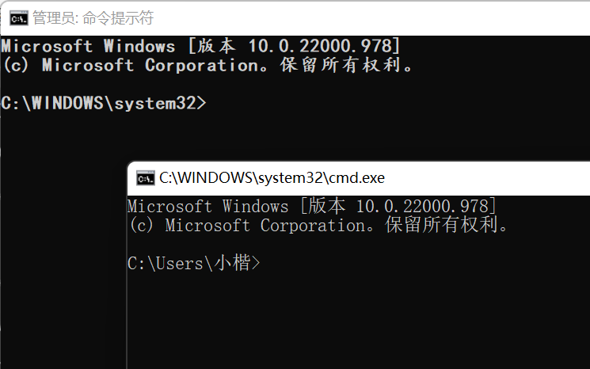
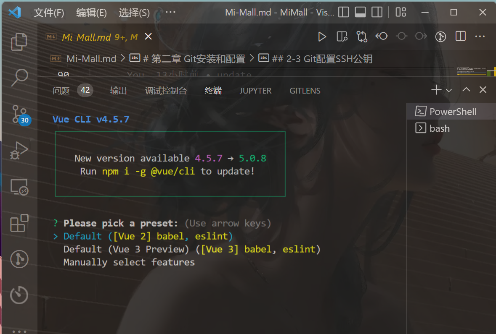
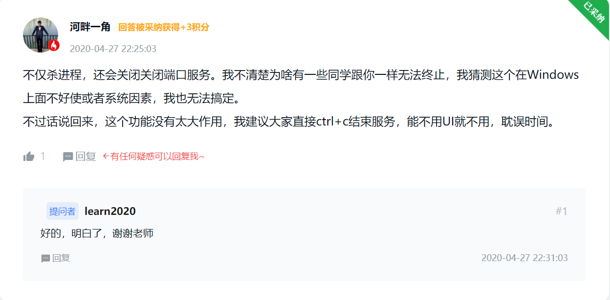
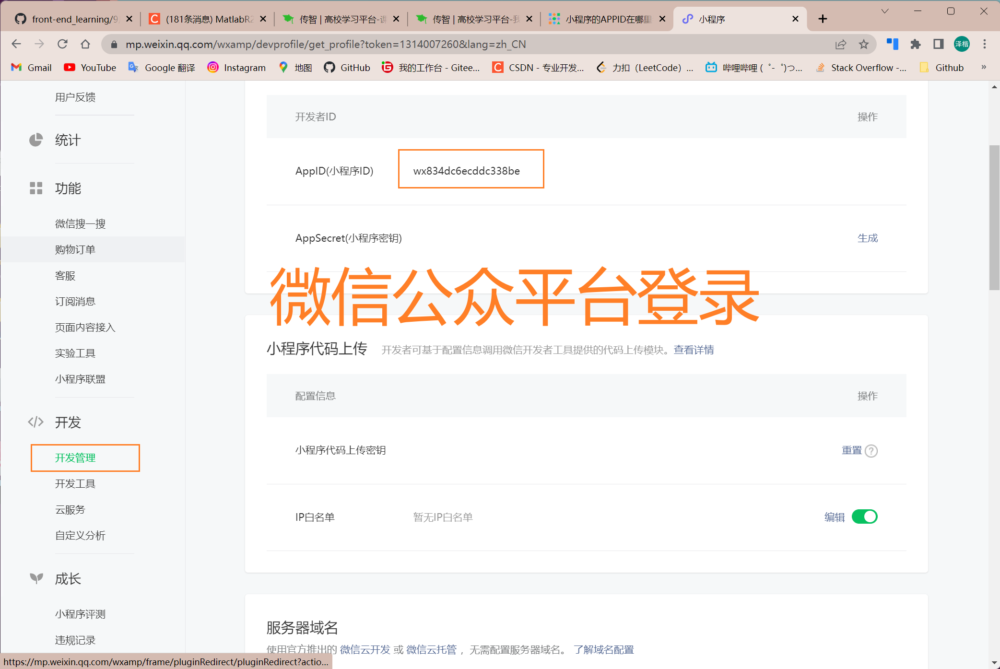

```html
9月18日 【Ben】

遇到的问题
Xxxxxx

今日小结
1.【小米商城】学习了VueCli4.0使用、跨域-CORS
2.【小米商城】3-2看到了4-1
3.开了VPN用不了微信开发者工具
4.vue3启动项目的命令是npm run serve

明日计划
1.【小米商城】学到4-8
```

​	



将管理员的命令窗口设置成楷体加粗 用于区分非管理员权限cmd和管理员权限cmd

​	

[vue无法加载文件C:\Users\Administrator\AppData\Roaming\npm\vue.ps1因为在此系统上禁止运行脚本……解决办法](https://blog.csdn.net/weixin_35773751/article/details/104415617?ops_request_misc=&request_id=&biz_id=102&utm_term=vue%20:%20%E6%97%A0%E6%B3%95%E5%8A%A0%E8%BD%BD%E6%96%87%E4%BB%B6%20C:%5CUsers%5C%E5%B0%8F%E6%A5%B7%5CAppDa&utm_medium=distribute.pc_search_result.none-task-blog-2~all~sobaiduweb~default-0-104415617.142^v47^pc_rank_34_default_2,201^v3^add_ask&spm=1018.2226.3001.4187)

​	



询问是否淘宝镜像源创建项目，使用cnpm create mall 我选择Yes 然后cli就给我升级了😢 害怕后面用不了

哦 没升级 要使用npm i -g @vue/cli进行升级😶‍🌫️

​	

[老师请教一下，我这边在VueCli UI系统中输入端口号，无法终止项目-慕课网 (imooc.com)](https://coding.imooc.com/learn/questiondetail/184854.html)



​	



AppID：wx834dc6ecddc338be

https://mp.weixin.qq.com/wxamp/devprofile/get_profile?token=1314007260&lang=zh_CN

