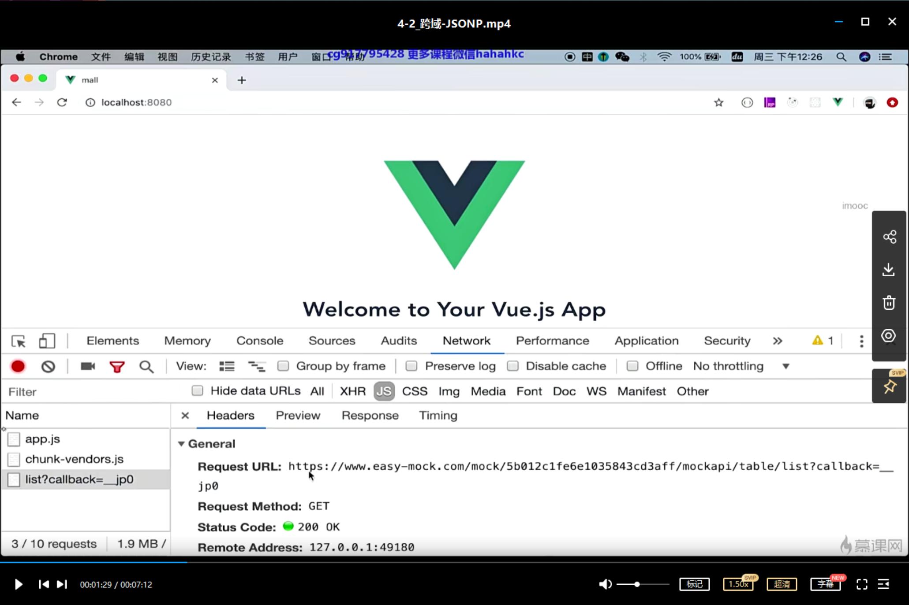
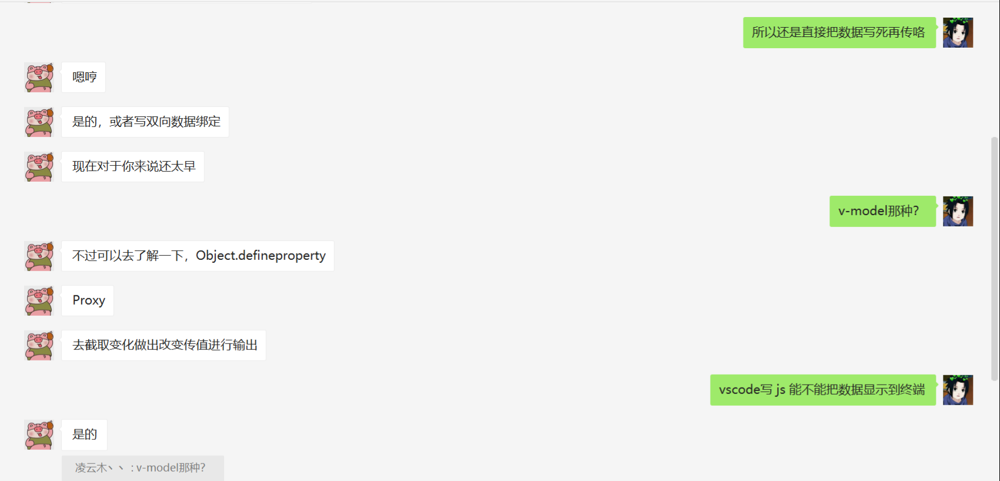
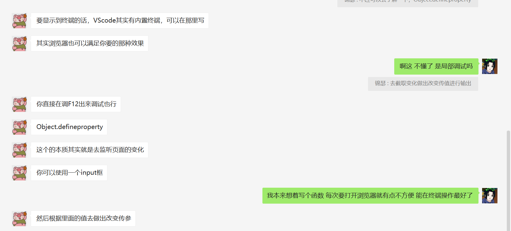

```html
9月19日 【Ben】

遇到的问题
Xxxxxx

今日小结
1.【小米商城】学习了跨域-JSONP、跨域-接口代理
2.【小米商城】4-2看到了4-3
3.Object.defineproperty了解一下
4.写完 javascript 代码，在VSCode 里面需要单独运行 javascript 文件，可以用到Code Runner插件. javascript 代码运行需要用到node.js环境。
5.JS在vscode终端打印结果 终端就如同控制台 需要console.log()的形式才能显示打印结果，document.writer()是显示不出来的 alert也是
6.【304状态码】如果客户端发送了一个带条件的GET 请求且该请求已被允许，而文档的内容（自上次访问以来或者根据请求的条件）并没有改变，则服务器应当返回这个304状态码。简单的表达就是：服务端已经执行了GET，但文件未变化。

明日计划
1.【小米商城】学到5-2
```

​	

[组合式 API 常见问答](https://cn.vuejs.org/guide/extras/composition-api-faq.html)

[大眼-巨好玩！](https://code.juejin.cn/pen/7132406758995132428)

[VSCode 使用教程-7.Code Runner运行 javascript 代码 ](https://www.cnblogs.com/yoyoketang/p/16693381.html)

​	

【小米商城】视频进度：



​	



