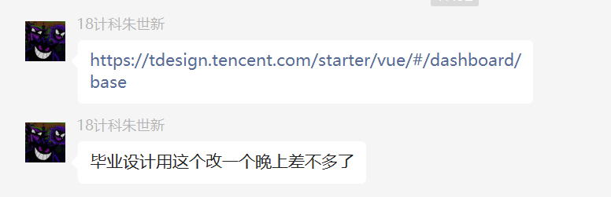
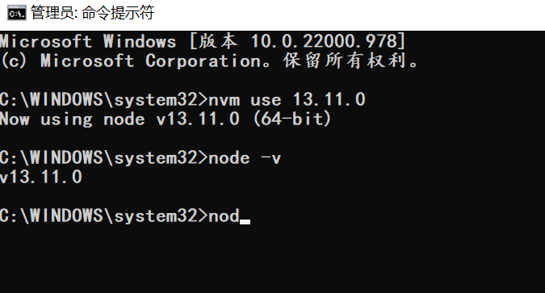

```html
9月20日 【Ben】

遇到的问题
Xxxxxx

今日小结
1.【小米商城】学习了xxx
2.【小米商城】4-4看到了第xx集
3.今日插件推荐 Image preview
4.今天疯狂了 打算一次性把依赖安装完毕看成果 大意了项目全崩
5.撕逼node_module 一定要备份一份纯净版的！！留待东山再起，艹
6.失败的一天 一天没学习 出现是scss错误知道是在哪里了，在App.vue中的style样式 scope引入scss 但并没有先npm install 导致 found not module
7.安装插件小合集：
npm install vue-lazyload@1.3.3 --save-dev
npm install element-ui@2.13.0 --save-dev
8.四、没有清理缓存
每次装包失败报错后记得都要 npm uninstall xxx 清除装包错误留下的缓存。
比如 npm i -D node-sass 报错了，就要执行一遍 npm uninstall node-sass，然后再重新安装。
9.sudo是mac下输入密码验证身份的命令，因此windows用户应该是以管理员身份运行命令行工具，然后删除sudo即可。
举个例子：删除版本mac下是sudo n rm 版本号，windows下应该是n rm 版本号。
10.npm install node-sass@4.13.0 --save-dev
11.今日mvp！！！！！！！！！！！
【npm install node-sass死活安装不上，最后终于搞定】
https://blog.csdn.net/wk964269669/article/details/72845651?spm=1001.2101.3001.6650.1&utm_medium=distribute.pc_relevant.none-task-blog-2%7Edefault%7ECTRLIST%7ERate-1-72845651-blog-125441010.pc_relevant_multi_platform_whitelistv6&depth_1-utm_source=distribute.pc_relevant.none-task-blog-2%7Edefault%7ECTRLIST%7ERate-1-72845651-blog-125441010.pc_relevant_multi_platform_whitelistv6&utm_relevant_index=2

明日计划
1.【小米商城】学到第xx集
```

​	

视频进度


​	

项目需要安装的依赖

```json
  "dependencies": {
    "@babel/plugin-syntax-dynamic-import": "^7.7.4",
    "axios": "^0.19.0",
    "core-js": "^3.3.2",
    "qrcode": "^1.4.4",
    "vue": "^2.6.10",
    "vue-infinite-scroll": "^2.0.2",
    "vue-router": "^3.1.3",
    "vuex": "^3.1.1"
  },
  "devDependencies": {
    "@vue/cli-plugin-babel": "^4.0.0",
    "@vue/cli-plugin-eslint": "^4.0.0",
    "@vue/cli-service": "^4.0.0",
    "axios": "^0.19.0",
    "babel-eslint": "^10.0.3",
    "babel-plugin-component": "^1.1.1",
    "element-ui": "^2.13.0",
    "eslint": "^5.16.0",
    "eslint-plugin-vue": "^5.0.0",
    "jsonp": "^0.2.1",
    "mockjs": "^1.1.0",
    "node-sass": "^4.13.0",
    "sass-loader": "^8.0.0",
    "vue-awesome-swiper": "^3.1.3",
    "vue-axios": "^2.1.5",
    "vue-cookie": "^1.1.4",
    "vue-lazyload": "^1.3.3",
    "vue-template-compiler": "^2.6.10"
  },

```

​	

当下我已安装的依赖

```json
  "dependencies": {
    "axios": "^0.27.2",
    "core-js": "^3.6.5",
    "vue": "^3.0.0",
    "vue-router": "^4.1.5",
    "vuex": "^4.0.2"
  },
  "devDependencies": {
    "@vue/cli-plugin-babel": "~4.5.7",
    "@vue/cli-plugin-eslint": "~4.5.7",
    "@vue/cli-service": "~4.5.7",
    "@vue/compiler-sfc": "^3.0.0",
    "axios": "^0.19.0",
    "babel-eslint": "^10.1.0",
    "eslint": "^6.7.2",
    "eslint-plugin-vue": "^7.0.0",
    "jsonp": "^0.2.1",
    "sass-loader": "^8.0.0"
  },
```

​	



​	

起飞！如何用nvm控制版本nodejs 下方两篇文章教学

[将nodejs的高版本降级为低版本（切换node版本）](https://juejin.cn/post/7094576504243224612)

[nvm安装，nvm use 一直报错exit status 1 或 exit status 145 问题？](https://wuhou.fun/390.html)

​	

今日mvp！！

[npm install node-sass死活安装不上，最后终于搞定](https://blog.csdn.net/wk964269669/article/details/72845651?spm=1001.2101.3001.6650.1&utm_medium=distribute.pc_relevant.none-task-blog-2%7Edefault%7ECTRLIST%7ERate-1-72845651-blog-125441010.pc_relevant_multi_platform_whitelistv6&depth_1-utm_source=distribute.pc_relevant.none-task-blog-2%7Edefault%7ECTRLIST%7ERate-1-72845651-blog-125441010.pc_relevant_multi_platform_whitelistv6&utm_relevant_index=2)

​	

