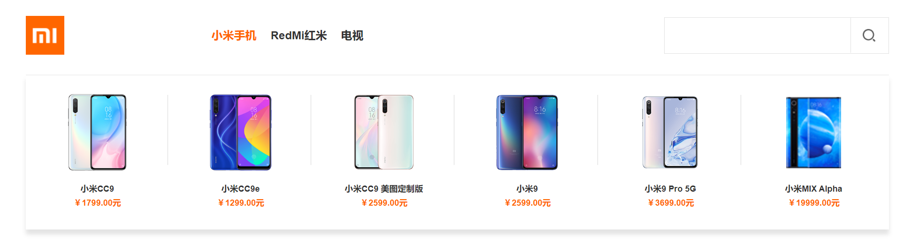

```html
9月26日 【Ben】

遇到的问题
Xxxxxx

今日小结
1.【小米商城】学习了xxx
2.【小米商城】5-5看到了第xx集
3.图片没加载出来就是路径有问题 可能是文件格式后缀出错 jpg/png
直接把路径打开到浏览器显示 显示得出来说明路径没问题

明日计划
1.【小米商城】学到第xx集
```

​	

[说说接口封装](https://www.cnblogs.com/yjf512/p/6525970.html)

vue3.x中过滤器已弃用

在 3.x 中，过滤器已删除，不再支持。相反地，我们建议用方法调用或计算属性替换它们。

[[vue/no-deprecated-filter] Filters are deprecated.](https://blog.csdn.net/HGGshiwo/article/details/119753259)




同样可以实现