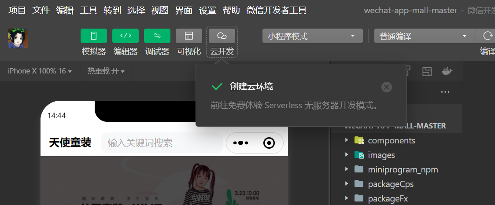

```html
9月28日 【Ben】

遇到的问题
【问题】
1.github里SPA是什么意思？
2.API是什么？

【解决】
1.SPA: 单页应用
2.就是很多关于我们这个插件里面的具体的配置参数都在里面，教程是什么？就是别人有写好的demo来告诉我们怎么去用，大家可以参考demo，别人demo怎么去写的，一般我们是先看教程，先看demo别人怎么去开发怎么去使用，然后当你做的时候，你的功能比别人的功能更复杂，那么这个时候可能它的demo太过于简单，那么这个时候你就需要参考API文档了，因为API文档写的更加详细，毕竟教程里面的demo都是只用到了几个API，你的功能更复杂，那么你就需要花更多的时间去参考里面更多的这种API文档，别人的demo不可能把所有的参数都列出来，这也不太现实。如果你的功能足够复杂，你就一定要花时间去看里面的API的每一个参数干什么用的

今日小结
1.【小米商城】学习了首页轮播功能、首页轮播菜单的功能实现
2.【小米商城】5-7看到了5-9
3.大家一定要学会看文档 知道怎么去集成我们里面这个插件的一些选项和语法

明日计划
1.【小米商城】学到5-13
```

​	

微信小程序 get√



